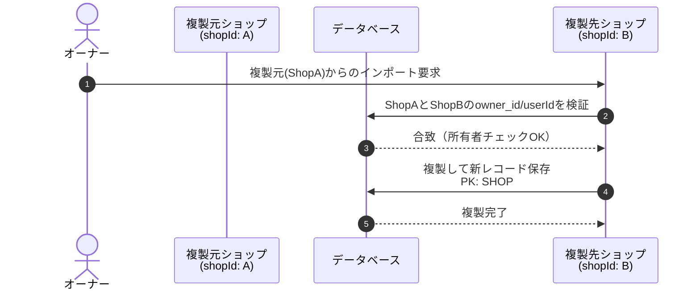
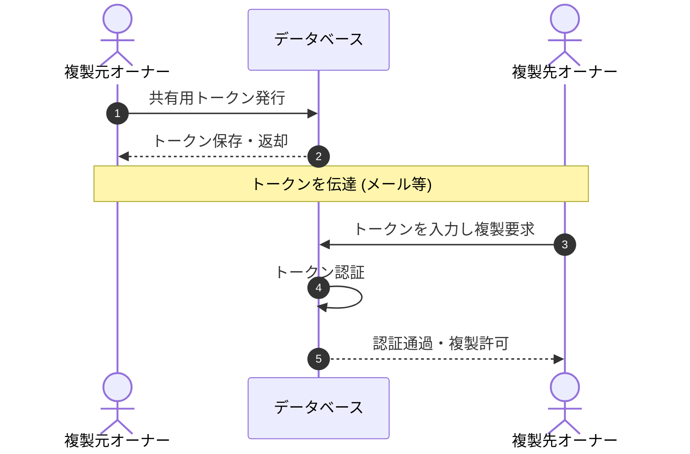
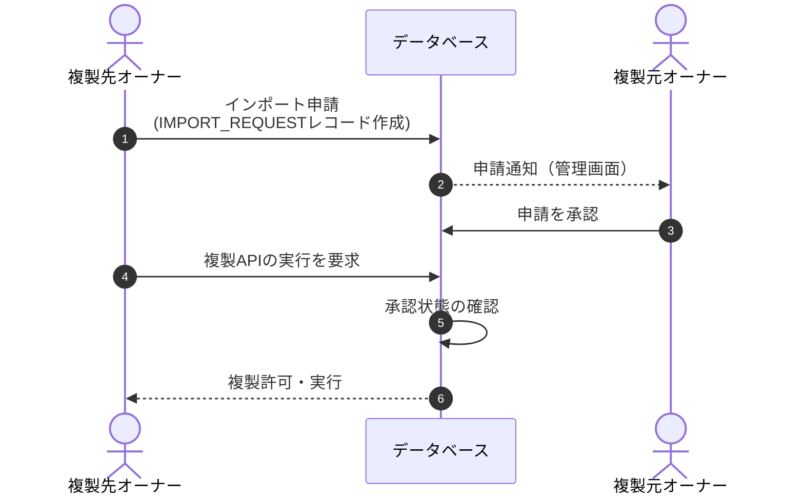

# TODO

### 優先度高め
- ほかショップからの商品情報のインポート
- インポート時の認証機能

### 優先度中
- パスワードの再設定機能(ショップ)
- パスワードの再設定機能(ユーザー)
- ショップの削除機能
- ユーザーの削除機能
- ショップの複数メール設定機能
- ファイアウォール(WAF)の有効化？(国内のみのアクセス制限、ランダムなUUIDに対する連続した受取り操作を行ったIPのアクセス制限) 月コスト+1000円~程度?

### 優先度低め
- 郵便番号からの住所検索
- チャットのメールアドレスのアンサブスクライブ
- ログイン時の2段階認証を常に有効化？
- ログイン後、時間経過で自動ログアウト？

## FUTURE
- ECサイト化、支払い機能
- 受け取り主個人による、有効化されていない特定商品用フリーQRカードのピック(お土産ショップ等で配布)、帰宅後にQRカードの支払い・有効化・住所入力
- 受け取り主のアカウント作成・管理

## 開発中
### ショップ間の商品インポート機能

同一オーナー（別ショップ間）でのインポート
- 要件: 自身が所有する別店舗(shopId)を指定し、商品を複製
- 解決策: 複製元と先、両ショップの owner_id と userId を検証。合致すれば新レコード (PK: SHOP#{新shopId}, SK: PRODUCT#{新Id}) として保存し複製



異なるオーナー間でのインポート（承認システム）
- 要件: 他オーナー商品のインポートを、明示的な許可ベースで実現
- 解決策(案1: トークン方式): 複製元がDBに「共有用トークン」を発行・保存。複製先が入力して認証を通過した場合に複製を許可



- 解決策(案2: 申請・承認方式): 複製先がDBに IMPORT_REQUEST レコードを作成。複製元が管理画面で「承認」した場合に限り、複製APIの実行を許可



#### 課題
- 同一IDの使用・ID以外をコピー： 商品からショップを一意に識別できなくなるが、異なるショップ間で融通しあえるQRコードを生成可能
- 商品は編集できない前提のため、ID使いまわしでも問題ないと思われるが、IDがIDしていない(一意でない)商品がレコード並ぶことになるため、データベースそのものの設計を見直す必要がある？
現状のデータ構造
- PK:SHOP#[shopId], SK:PRODUCT#[productUuid]
例:
```
PK:SHOP#[shop1], SK:PRODUCT#[123-aaa], ...
PK:SHOP#[shop2], SK:PRODUCT#[123-aaa], ...
```

#### データベース見直し案
1. PKを PRODUCT#[product UUID]とする商品単体のレコードを追加し、SHOP#[shop ID]において、products要素を追加して、その中にproduct UUIDを配列として格納する(この場合、商品から扱っているショップは検索できない…)
```
PK:PRODUCT#[123-aaa], SK:Metadata
PK:PRODUCT#[456-bbb], SK:Metadata
PK:SHOP#[shop1], { products: ["PRODUCT#123-aaa", "PRODUCT#456-bbb"] }, ...
PK:SHOP#[shop2], { products: ["PRODUCT#123-aaa", "PRODUCT#456-bbb"] }, ...
```

2. PKを PRODUCT#[product UUID]とする商品単体のレコードを追加することに加えて、各商品のIDとSHOPのIDの対応を表すだけのレコードを大量に追加する?
```
PK:PRODUCT#[123-aaa], SK:Metadata
PK:PRODUCT#[456-bbb], SK:Metadata
PK:SHOP#[shop1], SK:Metadata, ...
PK:SHOP#[shop2], SK:Metadata ...
PK:SHOP#[shop1], SK:PRODUCT#[123-aaa], GSI2_PK:PRODUCT#[123-aaa], GSI2_SK:SHOP#[shop1]
PK:SHOP#[shop1], SK:PRODUCT#[456-bbb], GSI2_PK:PRODUCT#[456-bbb], GSI2_SK:SHOP#[shop1]
PK:SHOP#[shop2], SK:PRODUCT#[123-aaa], GSI2_PK:PRODUCT#[123-aaa], GSI2_SK:SHOP#[shop2]
PK:SHOP#[shop2], SK:PRODUCT#[456-bbb], GSI2_PK:PRODUCT#[456-bbb], GSI2_SK:SHOP#[shop2]  #GSI2を用いることで商品からショップを検索可能
```
