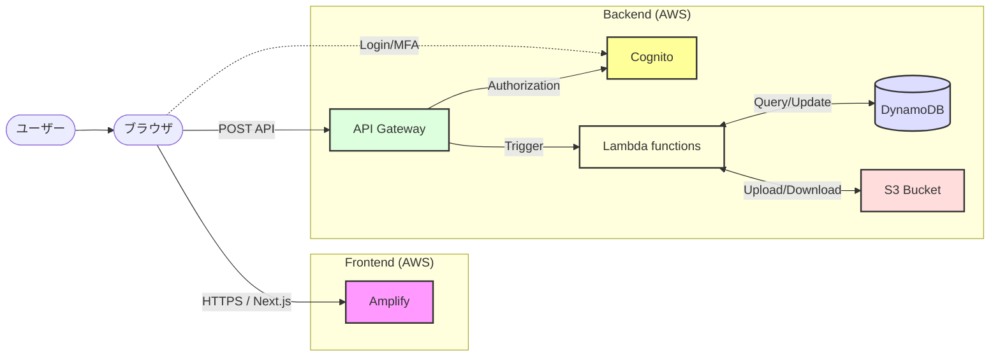
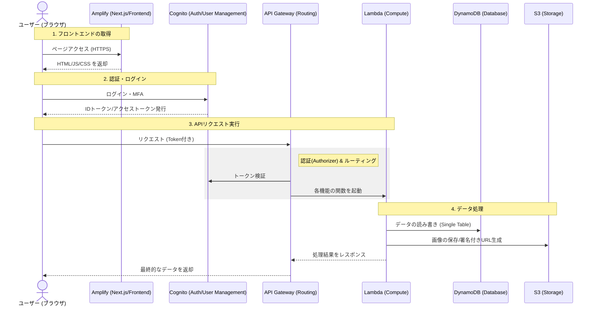

# 名刺代わりに - AWSアーキテクチャ・技術ガイド

本プロジェクトでは**「サーバーレス」**と呼ばれるアーキテクチャを採用しており、自前でサーバーの電源を入れて管理する代わりに、AWSの複数のクラウドサービスを組み合わせてバックエンドを構築しています。

このガイドでは、「どのAWSサービスがどんな役割を持っているか」「それがプロジェクトのどのコードと紐付いているか」を、AWS初心者向けに解説します。

---

## 1. 使用している主なAWSサービスと役割

フロントエンド（画面）からのリクエストを受け取り、データを処理して返すまでの間に、以下のサービスが連携して動いています。

### 🚪 **API Gateway** (窓口・ルーティング)
*   **役割**: フロントエンドからの通信（HTTPリクエスト）を一番初めに受け取る「窓口」です。
    URLのパス（例: `/shops` や `/admin/qrcodes`）を見て、「これはどのLambda関数に処理を任せるべきか」を振り分ける（ルーティングする）役割を持ちます。
*   **コード上の場所**: `infra/lib/infra-stack.ts` 内の `new apigateway.RestApi(...)` や `api.root.addResource(...)` でURLの設計を記述しています。

### ⚙️ **Lambda** (プログラムの実行環境)
*   **役割**: 実際にデータの計算やデータベースへの保存・取得を行う「プログラムの実行部」です。
    API Gatewayからリクエストが来た時だけ起動し、仕事を終えるとすぐに終了します。機能ごとに小さなLambda関数（例: 「一覧取得用」「QR生成用」）に分けて作られています。
*   **コード上の場所**: `infra/lambda/` フォルダの中にある各TypeScriptファイル（例: `admin-card-designs.ts`, `admin-list.ts`, `shop-mgmt.ts` など）が、Lambdaとして実行される実際のプログラムです。一番よく開発・修正する場所です。

### 🗄️ **DynamoDB** (データベース)
*   **役割**: ショップ情報、商品情報、QRコードの状態、ユーザー情報などを保存する「データベース」です。
    本プロジェクトでは「シングルテーブル設計」を採用しており、すべての種類のデータベースを1つの大きなテーブル（`MeishiGawariniTableV2`）の中に保存しています。
*   **コード上の場所**: `infra/lib/infra-stack.ts` の `new dynamodb.Table(...)` で作成し、実際のデータの読み書きは `infra/lambda/` 内のプログラムから行います。

### 🔐 **Cognito** (認証・ユーザー管理)
*   **役割**: ショップ管理者や全体管理者のログイン、パスワード管理、認証（この人は正しいユーザーか？）を担当するサービスです。
    ログインに成功したユーザーには「トークン（通行証）」を発行し、API Gatewayはそのトークンを見て通信を許可します。
*   **ユーザーグループ**:
    *   **`Administrators`**: QRコード生成・システム管理ダッシュボード (`/admin`) にアクセスできる管理者グループ。
    *   **`GlobalAdmins`**: Administratorsの権限に追加して，すべてのショップの管理画面を閲覧・編集可能なすべての権限を持つ最上位管理者グループ。
*   **MFA強制**: 上記グループに属するユーザーは、Lambda Authorizer (`infra/lambda/adminAuthorizer.ts`) によってTOTP（認証アプリ）によるMFA完了が必須チェックされます。MFA未設定のまま管理APIを叩くことはできません。
*   **コード上の場所**: `infra/lib/infra-stack.ts` の `new cognito.UserPool(...)` で構築されています。Cognito User Pool のティアは **Essentials** を使用しています。

### 📦 **S3** (ファイルストレージ)
*   **役割**: データベース（DynamoDB）には入りきらない「ファイルそのもの」を保存するストレージです。
    本プロジェクトでは主に**「商品の画像データ」**や**「カードデザインの背景画像・サムネイル」**を保存するために使用しています。
*   **コード上の場所**: `infra/lib/infra-stack.ts` の `new s3.Bucket('ProductImageBucket', ...)` で作成しています。また、画像処理用のユーティリティ `infra/lambda/utils/s3.ts` を通じてファイルの移動や署名付きURLの管理を行っています。

### 🌐 **Amplify** (フロントエンドのホスティング)
*   **役割**: ユーザーが見る画面（Next.jsで作ったHTML/CSS/JSファイル）をインターネット上に公開するためのサービスです。GitHubと連携しており、コードを `main` ブランチにプッシュすると自動で更新されます。
*   **コード上の場所**: `frontend/` フォルダ配下のコードすべてがAmplify上で動いています。

---

## 2. データの流れ（処理の全体像）

システムがどのように動いているか、具体的な操作を例にデータの流れを追ってみます。

6.  **Response**: 処理結果が API Gateway を経由してブラウザに返り、画面上に「生成完了」のメッセージが表示されます。

---

## 3. 主要 AWS リソース一覧 (Physical Resource List)

各環境（検証・本番）で実際に作成されている AWS リソースの物理的な名称・ID の一覧です。

| サービス | 役割 | 論理名 / ID (stg) | 物理名 / ID (prod) |
| :--- | :--- | :--- | :--- |
| **DynamoDB** | メインデータベース | `MeishiGawariniTableV2-stg` | `InfraStack-MeishiGawariniTableV218E81B62-17GD6BQFOY8ZG` |
| **S3** | 商品画像ストレージ | `ProductImageBucket-stg` | `ProductImageBucket` |
| **Cognito** | ユーザー認証プール | `MeishiGawariniUserPool-stg` | `MeishiGawariniUserPool` |
| **API Gateway** | API エントリポイント | `MeishiGawarini Service-stg` | `MeishiGawarini Service` |

> [!NOTE]
> `stg` 等の環境では、物理名に `-stg` などのサフィックスが付与されます。本番環境 (`prod`) の DynamoDB は既存リソースをインポートして利用しているため、固有のランダムな文字列が含まれています。