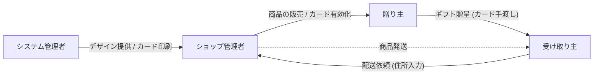
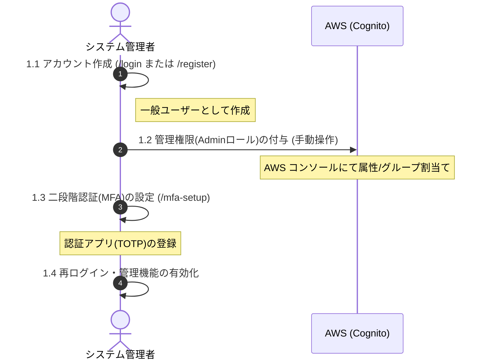
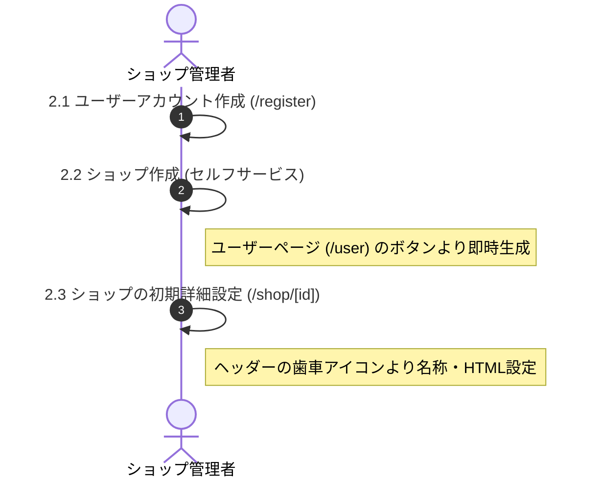
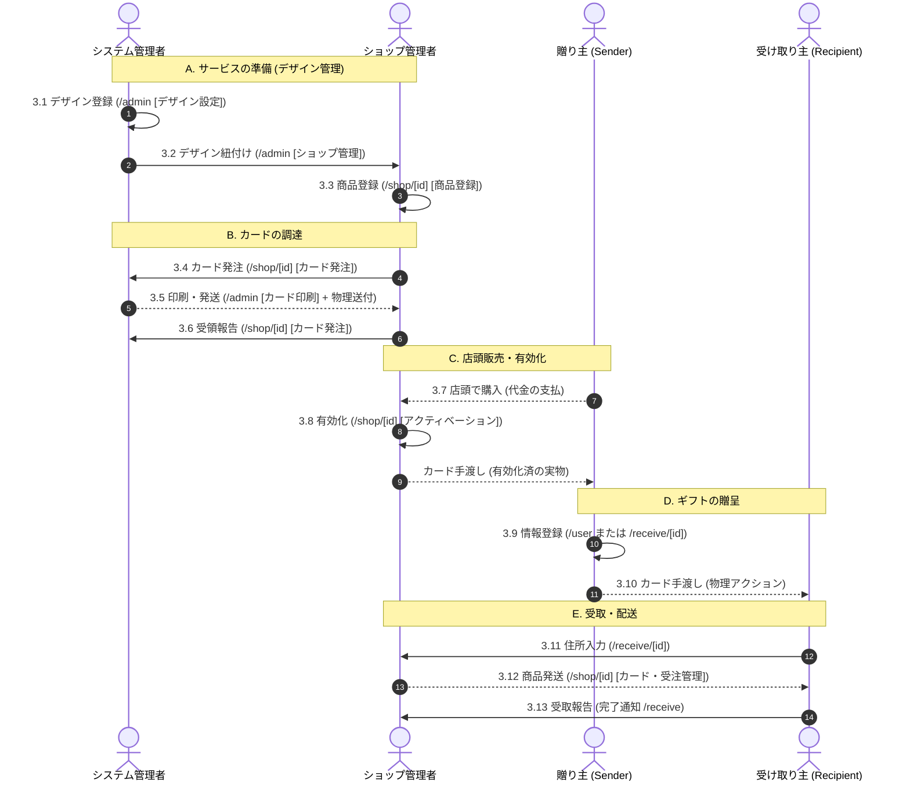
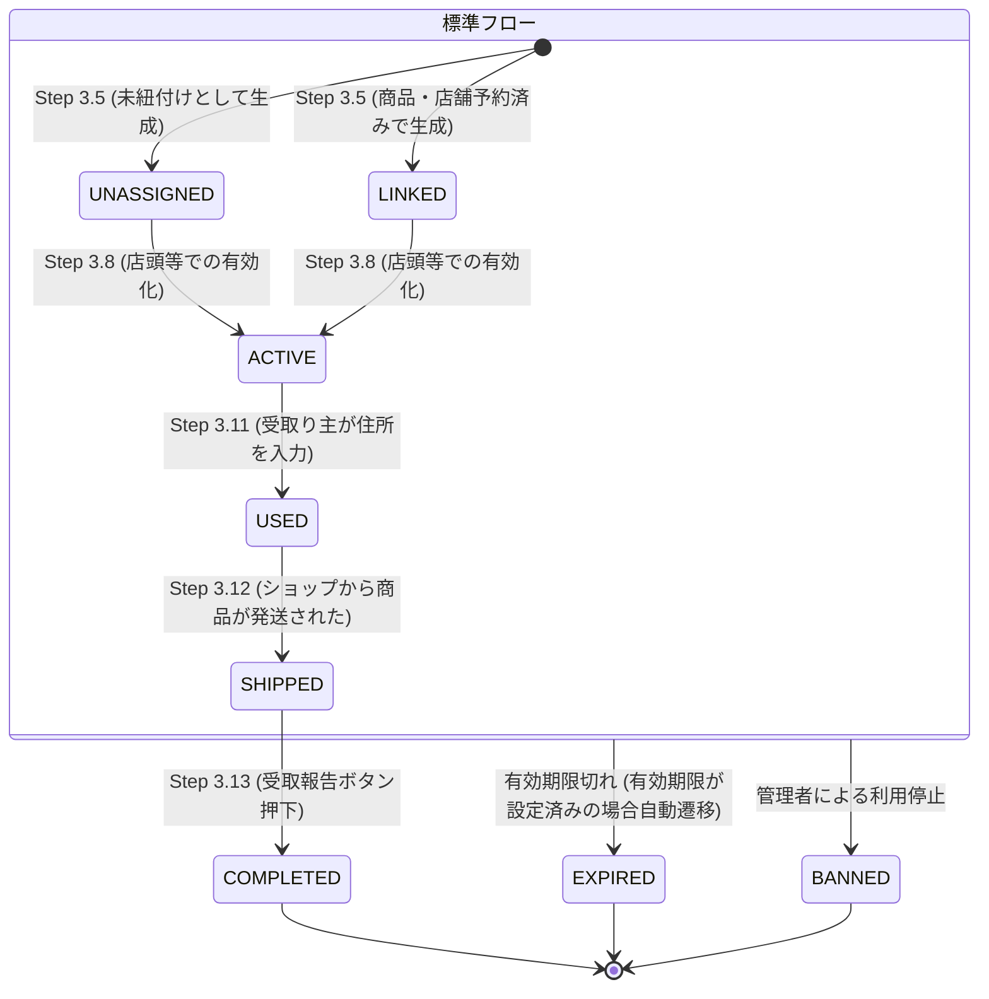
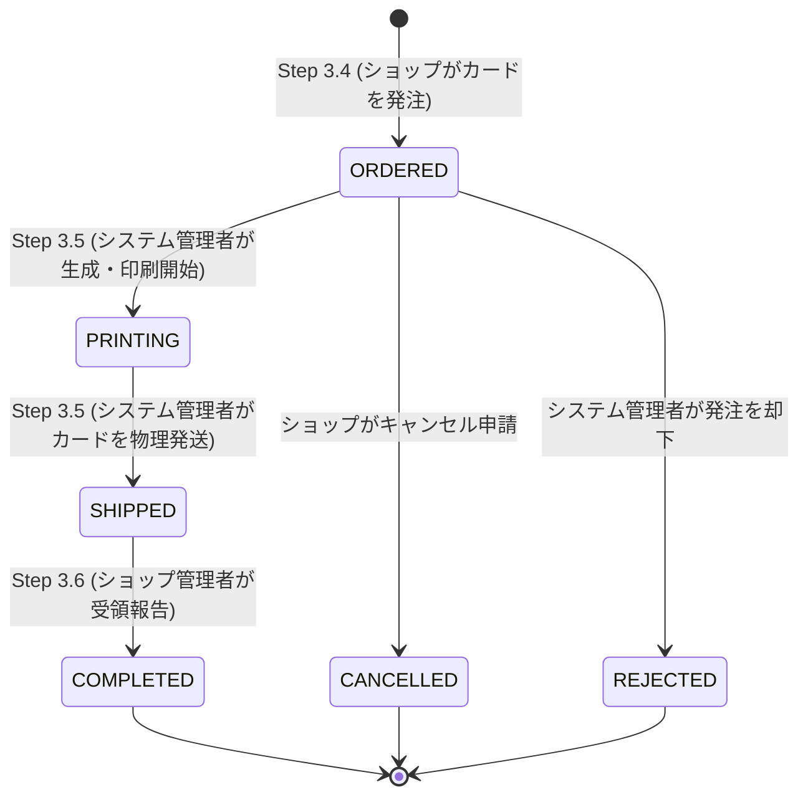
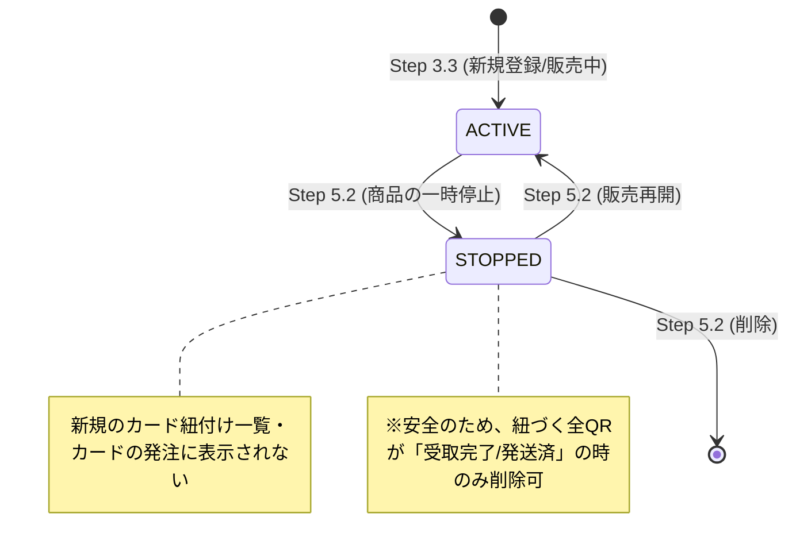

# 運用フロー (Operation Flow) 

本ドキュメントでは、システムの基盤設定からショップの自律的開設、および日常的なデータ・物流サイクルを、実機の画面構成（URL、タブ名、ボタンラベル）に基づき正確に定義します。

---

## 0. 登場人物（ロール）の定義
システムを構成する4つの主要な役割を定義します。

| ロール名 (略称) | 主な役割・権限 | 使用する主な画面 (URL) |
| :--- | :--- | :--- |
| **システム管理者 (SA)** | **プラットフォーム全体の運営者。** カードデザインのマスター登録、物理カードの印刷・発送、全ショップの統括管理を行います。 | `/admin` |
| **ショップ管理者 (SO)** | **各店舗のオーナー・スタッフ。** 自身のショップ開設、商品の登録、カードの発注、受注した商品の発送業務を行います。 | `/shop/[shop_id]` |
| **贈り主 (SD / Sender)** | **ギフトカードの購入者。** ショップでカードを購入し、自身のプロフィールを登録して、心のこもったメッセージと共に相手へ贈ります。 | `/user`, `/receive/[qr_id]` |
| **受け取り主 (RC / Recipient)** | **ギフトの受取人。** 受け取ったカードから情報を閲覧し、配送先住所を入力してギフト（実物商品）を受け取ります。 | `/user`, `/receive/[qr_id]` |

---

## Phase 1: システム管理者のアカウント準備 (基盤)
プラットフォーム全体を管理するための初期権限を確立する段階です。

### 1.1 管理者設定シークエンス

### 1.2 詳細手順 (Phase 1)
| No | ステップ | 実行者 | 操作場所 (URL/ツール) | 内容 |
| :--- | :--- | :--- | :--- | :--- |
| 1.1 | 管理者アカウント作成 | システム管理者候補 | `/login` (または register) | 一般ユーザーと同様にアカウントを作成（サインアップ）します。 > [!IMPORTANT] 外部認証アカウント（Google/Amazon等）ではなく、必ず**メールアドレスとパスワード**で新規作成したアカウントを使用してください。外部認証ではMFA（2段階認証）が有効化されないため、管理画面へのアクセスが拒否されます。 |
| 1.2 | 管理者権限の付与 | システム管理者 (開発者) | **AWS Cognito Console** | > [!WARNING] Admin ロールの付与は、セキュリティ上の制約により AWS Cognito コンソール上での直接操作（グループ `Admins` への追加等）でのみ実行可能です。 |
| 1.3 | **二段階認証 (MFA) の設定** | システム管理者 | `/mfa-setup` | > [!IMPORTANT] 管理者はMFA設定が必須です（他サイト認証によるログインは管理者として不適（MFAが設定できないため）メール・パスワード認証時のみ有効）。認証アプリ（Google Authenticator等）でQRをスキャンし、6桁のコードを入力して有効化します。完了後に再ログインすることで、`/admin` へのアクセスが可能になります。 |

---

## Phase 2: ショップの開設・初期設定 (自律的な開設)
ユーザーアカウントを作成し、自身の判断でショップを開設して開店準備を行う段階です。

### 2.1 開店・初期設定シークエンス

### 2.2 詳細手順 (Phase 2)
| No | ステップ | 実行者 | 操作場所 (URL / ボタン) | 内容 |
| :--- | :--- | :--- | :--- | :--- |
| 2.1 | ユーザーアカウント作成 | ショップオーナー | `/register` | ショップを開設する一般ユーザーとしてサインアップします。 |
| 2.2 | **ショップ作成** | ショップオーナー | `/user` (マイページ) > **「ショップを開設する」** | ボタン押下後、`/shop` (マイショップ一覧) にアクセスします。ショップが未作成の場合、最初の一回に限りシステムがデフォルトショップを自動生成します。 |
| 2.3 | **ショップの初期詳細設定** | ショップオーナー | `/shop/[id]` (個別ショップ画面) > **歯車アイコン (ショップ設定)** | 個別ショップ画面のヘッダーにある歯車アイコンをクリックし、**「ショップ名」**や**「ショップ紹介(HTML)」**を入力して「保存」します。 |

---

## Phase 3: 日常的な運用サイクル (日々のサイクル)
カードのデザインから、商品の調達・販売・配送までの繰り返されるビジネスサイクルです。

### 3.1 運用シーケンス図 (アクター間相互作用)
> [!NOTE]
> **凡例**: 実線矢印はシステム操作・情報登録、破線矢印は実際のモノの移動を表します。

### 3.2 詳細手順 (日常運用)

| No | ステップ | 実行者 | 操作場所 (URL / タブ / ボタン) | 内容 |
| :--- | :--- | :--- | :--- | :--- |
| 3.1 | デザインの作成・登録 | システム管理者 | `/admin` (タブ: **デザイン設定**) | 新しいカードデザイン(JSON)を `CardDesignEditor` で登録・更新します。 |
| 3.2 | デザインの紐付け | システム管理者 | `/admin` (タブ: **ショップ管理**) | 「ショップとカードデザインの紐付け管理」セクションにて、対象ショップが使用できるデザインを許可リストに追加します。 |
| 3.3 | 商品の登録 | ショップ管理者 | `/shop/[id]` (タブ: **商品登録**) | 「商品追加」ボタンから、ギフトの名称・画像・詳細HTML・使用デザインを登録します。 |
| 3.4 | カードの発注 | ショップ管理者 | `/shop/[id]` (タブ: **カード発注**) | 発注枚数と紐付ける商品を選択し、「この内容で発注する」ボタンを押します。 |
| 3.5 | **カードの印刷・発送** | システム管理者 | `/admin` (タブ: **カード印刷**) | ショップからの発注に対し、「印刷用PDF」を出力して物理カードを作成。発送後、**カード発注ステータス**を「発送済み」に更新します。 |
| 3.6 | **カード受領報告** | ショップ管理者 | `/shop/[id]` (タブ: **カード発注** > **発注履歴**) | 届いたカードの横にある**「受け取り完了」**ボタンを押し、**カード発注ステータス**を「完了」に更新。システム管理者に通知されます。 |
| 3.7 | 店頭での購入 | 贈り主 | (物理店舗等) | 顧客（贈り主）がショップでギフトカードを購入します。 |
| 3.8 | **アクティベーション** | ショップ管理者 | `/shop/[id]` (タブ: **アクティベーション**) | カードをスキャンし、「連携して有効化」で **QRステータス** を `ACTIVE`（有効）にします。ここから期限のカウントダウンが始まります。 |
| 3.9 | 名刺情報の登録 | 贈り主 | `/user/editprofile` / `/receive/[id]` | 贈り主のプロフィールを登録します。 |
| 3.10 | **カードの手渡し** | 贈り主 | (物理アクション) | 受け取り主へ物理カードを手渡します。 |
| 3.11 | 住所情報の入力 | 受け取り主 | `/receive/[id]` | PIN入力後、配送先情報を送信。**QRステータス** が `USED` （発送待ち）に移行します。 |
| 3.12 | **商品発送・登録** | ショップ管理者 | `/shop/[id]` (タブ: **カード・受注管理**) | 発送後、「発送する」ボタンから追跡番号を登録。**QRステータス** を `SHIPPED`（発送済み）に更新します。 |
| 3.13 | **受領報告 (完了)** | 受け取り主 | `/receive` (受取完了ページ) | 商品到着後、「受け取り完了」ボタン押下により、**QRステータス** を `COMPLETED`（完了）に更新し、全行程が終了します。 |

---

## 4. ユーザーページ (マイページ) の機能
一般ユーザー（贈り主・受け取り主）が自身のデータを管理するためのハブ画面です。

### 4.1 主要メニュー構成
| メニュー名 | 操作場所 (URL) | 主な役割 |
| :--- | :--- | :--- |
| **あなたのプロフィール** | `/user/editprofile` | 贈り主としてギフトに添える「名刺情報」の編集・管理。 |
| **ギフトを贈る前に** | `/user/sendgift` | 物理カードの一括スキャンによる贈り主情報の紐付け、および事前登録。 |
| **贈ったギフト** | `/user/sentmemory` | これまでに自分が贈ったギフトのリスト。ギフトページに移動可能。 |
| **受け取ったギフト** | `/user/receivedmemory` | これまでに自分が受け取ったギフトのリスト。ギフトページに移動可能。 |
| **いつもの受け取り住所** | `/user/editdelivery` | ギフト受取時の配送先情報の既定値（テンプレート）を設定。 |
| **ショップを開設する** | (下部ボタン) | ユーザーが自身のショップを即時に新規作成。 (詳細は Phase 2 参照) |

---

## 5. 補足的な操作 (その他の機能)
主要な運用サイクル以外に提供されている、管理者やユーザー向けの補助機能です。

### 5.1 システム管理者向け (Admin)
- **カードのBAN / 復元**: 不正利用が疑われるカードの即時停止、および誤BANの解除。
- **ショップの管理**: ショップオーナーの変更（移管）や、複数名の管理責任者(GM)の紐付け。
- **データダンプ**: 調査用にデータベースの生レコードを直接確認。

### 5.2 ショップ管理者向け (Shop Admin)
- **商品の削除**: 受注停止だけでなく、不要になった商品情報を物理的に削除。
- **商品一括インポート [試験段階]**: 自身が管理する他店舗から商品情報をコピー。
- **紹介HTML用画像の管理**: 独自のショップ紹介や商品紹介HTMLに使用する画像をアップロードし、URLを管理。

### 5.3 ユーザー向け (Sender / Recipient)
- **リッチチャット・通知**: 贈り主と受け取り主の間での、動画・画像を含むメッセージ交換と、新着メッセージのメール通知設定。
- **閲覧パスワード設定**: 贈り主（または第三者）による配送詳細情報の閲覧を制限するためのパスワード保護。
- **プロフィールの「出力」と「インポート」**: 
    - 自身の名刺情報をシステム独自形式でデータベースに保存し、生成されたIDを他者に伝える、または他のギフトに貼り付けることで情報を引き継ぐ機能。
    - > [!IMPORTANT]
      > ユーザーページができたため削除予定の機能。本機能は「ファイルへのエクスポート」ではなく、システム内でのデータ紐付けのための「ID発行と読み込み」として動作します。

---

## 6. ステータスのライフサイクル定義
システム上には「カードの発注管理」と「ギフト（QR）の状態管理」の2つの独立したライフサイクルが存在します。

### 6.1 QRコード（ギフト）のライフサイクル
個別のQRコード（ギフト体験）が辿る、受取人との取引状態です。

### 6.2 カード発注（CardOrder）のライフサイクル
ショップ管理者からシステム管理者（本部）への「物理カード」の発注プロセスです。

### 6.3 商品（Product）のライフサイクル
ショップ内で管理される「ギフト商品」自体の販売・取り扱い状態です。

