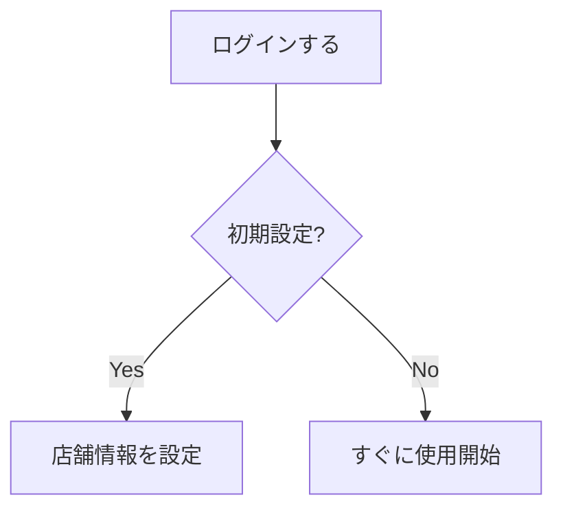

# デザイナー向けヘルプページ編集ガイド

このドキュメントは、「名刺代わりに」のヘルプページを編集・作成し、ローカル環境で表示を確認した上で、変更内容を送信するデザイナー向けの手順書です。

デスクトップ上に自動で作業環境（フォルダ、Git環境、ショートカット）を作成するセットアップスクリプトを用意しています。

---

## 1. 初回の自動セットアップ (一度だけ実施)

まずは、デスクトップに必要なフォルダやGit環境、プレビュー用のショートカットを一瞬で作成します。

### Step 1. 事前チェック
お使いのMacに以下のツールがインストールされているか確認してください。インストールされていない場合は、あらかじめインストールしておきます。
1. **Node.js (LTS推奨) のインストール**
   * [Node.js 公式サイト](https://nodejs.org/) から「LTS」と書かれた推奨版をダウンロードしてインストールします。
2. **VS Code (エディタ) のインストール**
   * Markdownファイルを編集するため、[VS Code 公式サイト](https://code.visualstudio.com/) からインストールします。
3. **GitHubへのアカウント作成と権限設定**
   * GitHub アカウントを作成し、管理者に自身のアカウント名を伝えて、このリポジトリへの共同編集権限（Collaborator）を付与してもらってください。
   * Macのターミナル等でGitHubへプッシュできるよう、SSHキーの登録、またはGitHub Desktopなどを通じた認証ログインを完了させておいてください。

### Step 2. セットアップスクリプトの実行
1. 管理者から受け取った `setup_help_editor.command` ファイルを、Macの **デスクトップ** に保存します。
2. デスクトップの `setup_help_editor.command` を **ダブルクリック** して実行します。

> [!NOTE]
> **「開発元が未確認のため開けません」と警告が出た場合**
> ファイルを右クリック（または二本指タップ）して「開く」を選択し、確認ダイアログで再度「開く」をクリックしてください。
>
> **「実行するのに十分な特権がありません」とエラーが出た場合**
> インターネット等から直接ダウンロードしたファイルは、Macのセキュリティ制限で実行権限が外れていることがあります。
> その場合は、Macの「ターミナル」アプリ（Finder ＞ アプリケーション ＞ ユーティリティ ＞ ターミナル）を開き、以下のコマンドを貼り付けて `Enter` を押してから、もう一度ダブルクリックしてください。
> ```bash
> chmod +x ~/Desktop/setup_help_editor.command
> ```

3. ターミナルが起動し自動的に処理が走り、デスクトップ上に以下のアイテムが格納された 📁 **`名刺代わりに_ヘルプ編集`** フォルダが自動生成されます。
   * 📁 **`画像フォルダ`**（ここを開いてスクリーンショット画像を追加します）
   * 📁 **`ヘルプ記事フォルダ`**（ここを開いてMarkdownファイルを編集します）
   * ⚙️ **`1_ヘルプを編集・確認する.command`**（プレビュー起動用）
   * ⚙️ **`2_変更を送信する.command`**（Git送信・プルリク作成用）

これで準備は完了です！デスクトップに置いた `setup_help_editor.command` はゴミ箱に捨てて構いません。


---

## 2. 日常の作業手順 (編集 ➡️ 表示確認 ➡️ 送信)

作業はすべて、デスクトップ上に作成されたフォルダやショートカットを使って行います。

### Step 1. プレビューサーバーの起動
1. デスクトップにある **`1_ヘルプを編集・確認する.command`** をダブルクリックして起動します。
   * *※ 初回のみ「開発元が未確認のため開けません」等のセキュリティ警告が出た場合は、ファイルを右クリック（または二本指タップ）し、「開く」を選択してください。*
2. ターミナルが起動し、自動的に最新のコードを取得（Git Pull）し、開発サーバー（`npm run dev`）が立ち上がります。
3. 3〜5秒ほど経つと、自動的にブラウザでローカルサーバー (`http://localhost:3000`) が開きます。

### Step 2. Markdownファイルの編集と画像の追加
1. デスクトップの **`ヘルプ記事フォルダ`** を開き、編集したい記事のフォルダ（例: `shop/` など）の中にある `index.md` を VS Code 等で開いて編集します。
2. 使用するスクリーンショット画像は、デスクトップの **`画像フォルダ`** の中に保存（拡張子は `.webp` 推奨）します。
3. Markdownファイル内には、以下のように画像を記述します。
   ```markdown
   
   ```
4. ファイルを保存すると、ブラウザで開いているプレビュー画面にリアルタイムで変更内容が反映されます。

### Step 3. 変更内容の送信 (Git Push)
編集が完了し、ブラウザでの表示も確認できたら、以下の手順で変更をGitHubへ送信します。

1. 起動しているプレビューサーバー（`1_ヘルプを編集・確認する.command` のターミナル画面）を閉じます。
2. デスクトップにある **`2_変更を送信する.command`** をダブルクリックします。
3. 画面に今回変更したファイルの一覧が表示されます。
4. ターミナル上で「**どのような変更を行いましたか？（コミットメッセージ）**」と聞かれるので、変更内容（例: `ログイン手順のヘルプを追加` など）を入力して `Enter` キーを押します。
5. 自動的に変更内容がコミットされ、GitHubに送信（Push）されます。
6. 送信が完了すると、自動的にブラウザで GitHub の「Pull Request（プルリクエスト）」作成画面が開きます。
7. 画面上の **「Create pull request」** ボタンを押して、開発者にレビューと反映を依頼してください。

### Step 4. 別の日に新しくヘルプ編集を開始する場合 (作業の更新・リセット)
前回の作業が完了し、新しく別のヘルプ記事を書き始めたい場合や、PC内の古い作業データをリセットして最新の本番データからやり直したい場合は、以下の手順を行います。

1. 再度、デスクトップにある `setup_help_editor.command` をダブルクリックして実行します。
2. もし前回の作業データ（コミットしていない変更など）が残っていた場合、スクリプトが**自動的に前回の変更を保存・コミットして GitHub へプッシュ**し、ブラウザでプルリクエスト作成画面を開きます。
3. その後、PC内の古い作業用データは安全に削除され、GitHub から最新の `master` データを取得した上で、新しい日の作業用ブランチが自動的に作成されます。
4. これにより、常に安全かつクリーンな状態で新しい作業をスタートできます。

---

## 3. 基本的な Markdown の書き方

ヘルプ記事は、以下の一般的な Markdown 記法を使って執筆します。

### ① 見出し
行頭に `#` を半角スペース付きで書くことで、見出しを作成できます。
*   `# タイトル`（※ファイル内で1回だけ、通常は最上部のタイトルに使用します）
*   `## 大見出し`（セクションの区切り）
*   `### 小見出し`（より細かい段落）

*   **【表示プレビュー】**:
    > # タイトル
    > ## 大見出し
    > ### 小見出し

---

### ② 太字
強調したい文字を `**` で囲みます。

*   **記述例**:
    ```markdown
    この操作は **必ず** 実行してください。
    ```
*   **【表示プレビュー】**:
    > この操作は **必ず** 実行してください。

---

### ③ 箇条書き
行頭に `-` または `*` を半角スペース付きで書きます。

*   **記述例**:
    ```markdown
    - 手順 A
    - 手順 B
      - ネスト（タブでインデント）させることもできます
    ```
*   **【表示プレビュー】**:
    > * 手順 A
    > * 手順 B
    >   * ネスト（タブでインデント）させることもできます

---

### ④ 番号付きリスト
行頭に `1.` などを半角スペース付きで書きます。

*   **記述例**:
    ```markdown
    1. アプリを起動する
    2. 設定を開く
    ```
*   **【表示プレビュー】**:
    > 1. アプリを起動する
    > 2. 設定を開く

---

### ⑤ リンクの挿入
`[表示テキスト](URL)` の形式で記述します。

*   **記述例**:
    ```markdown
    詳細は [管理者ガイド](/help/admin) を参照してください。
    ```
*   **【表示プレビュー】**:
    > 詳細は [管理者ガイド](/help/admin) を参照してください。

---

### ⑥ 画像の表示
`` の形式で記述します。

*   **記述例**:
    ```markdown
    
    ```
*   **【表示プレビュー】**:
    > (※ 実際には、`Alternative Text` をキャプションに持ち、角丸でスタイリングされた画像が表示されます。)
    >
    > > [!IMPORTANT]
    > > 画像は必ず `frontend/public/images/manual/` フォルダの中に格納し、パスの先頭は `/images/manual/` で指定してください。

---

### ⑦ 表（テーブル）
項目を縦棒 `|` で区切って表を作成できます。

*   **記述例**:
    ```markdown
    | 項目名 | 設定値 | 説明 |
    | :--- | :--- | :--- |
    | モード | ON | 有効化します |
    ```
*   **【表示プレビュー】**:
    > | 項目名 | 設定値 | 説明 |
    > | :--- | :--- | :--- |
    > | モード | ON | 有効化します |

---

## 4. 特殊な独自記法（カスタマイズ装飾）

本プロジェクトのヘルプシステム向けに、独自にデザインされた特殊な記法です。

### ① 丸数字付き見出し
見出しレベル3（`###`）の直後に「半角数字」を入れると、表示される際に自動的に**美しくナンバリングされた丸数字のアイコン**に変換されます。手順書の見出しに最適です。
```markdown
### 1 ログインする
```

### ② 注意書き枠 (Notice)
補足事項や警告など、薄い背景色で囲って目立たせたい場合に使用します。
```html
<section class="notice">
※ パスワードを忘れた場合は再発行手続きを行ってください。
</section>
```

### ③ 特徴・メリット枠 (Benefit)
機能のメリットや、おすすめの使い方をグラデーション付きの枠線で強調したい場合に使用します。
```html
<section class="benefit">
この設定を行うことで、カードの読み取り速度が大幅に向上します。
</section>
```

### ④ 最重要お知らせ枠 (Hero)
最優先で読んでほしいブランドカラーの巨大な重要枠を作成します。
```html
<section class="hero">
本番稼働前に、必ずテスト用カードでの決済確認を行ってください。
</section>
```

### ⑤ 誘導カードリンク (Help Card)
他ページへ誘導するための、アイコン付きの並列カード型リンクです。
```html
<div class="grid-help">
  <a href="/help/shop/activate" class="card-help" data-icon="qrcode">
    ## アクティベーション
    カードを有効化する手順を確認します。
  </a>
  <a href="/help/shop/settings" class="card-help" data-icon="settings">
    ## 基本設定
    ショップ情報の基本設定を行います。
  </a>
</div>
```
*(※ `data-icon` に指定できる値は、`qrcode`, `store`, `settings`, `help-circle` などが用意されています)*

### ⑥ フローチャート (Mermaid)
Markdown内に動的な手順フロー図を描画することができます。
```markdown

```


