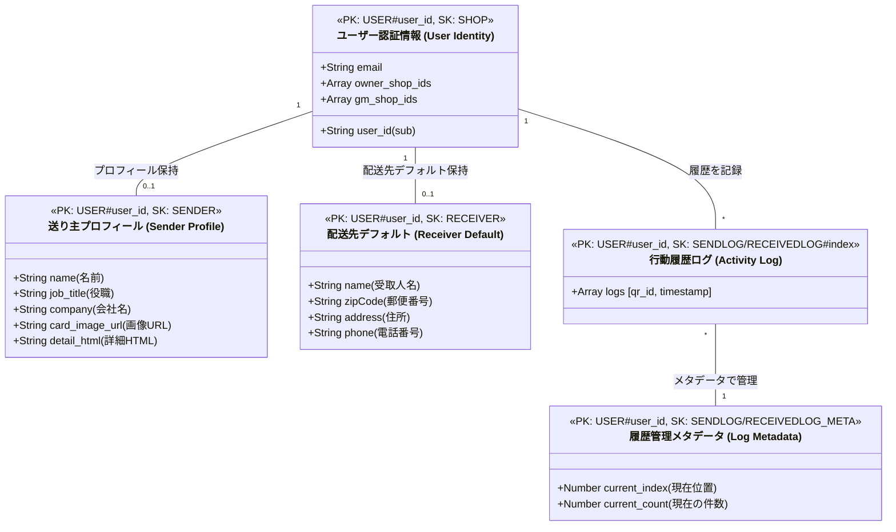
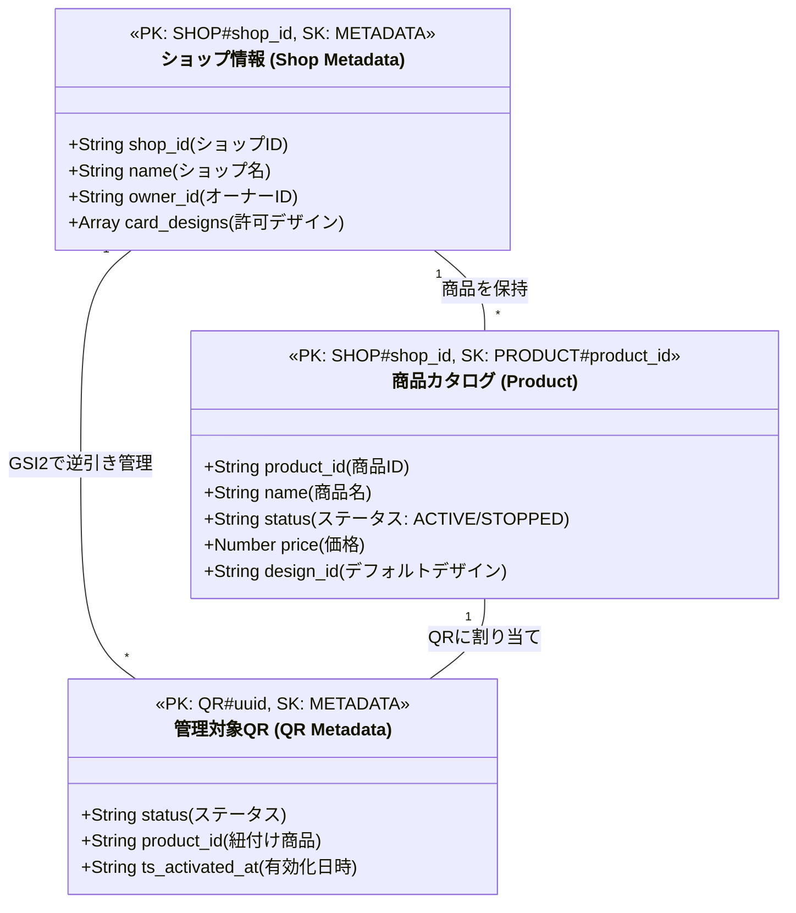
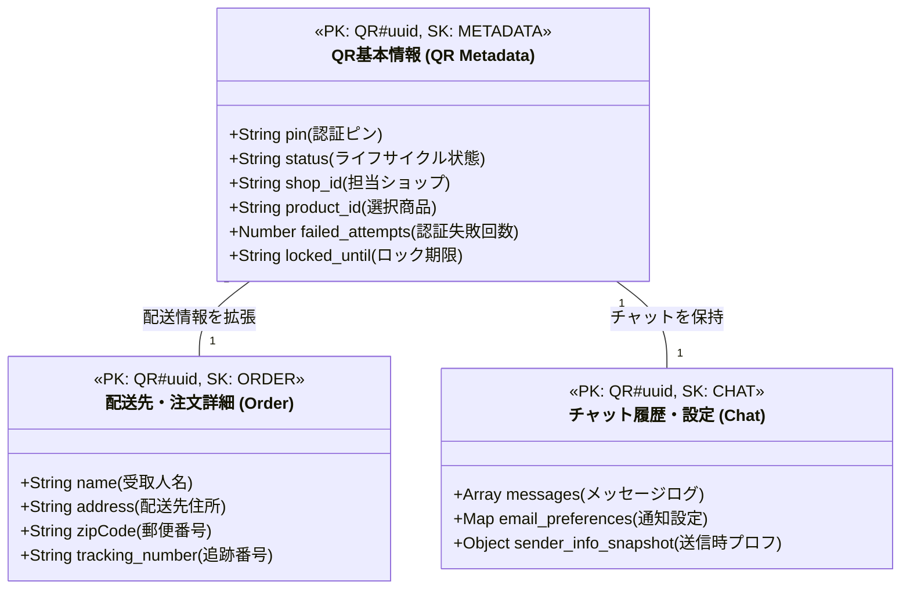
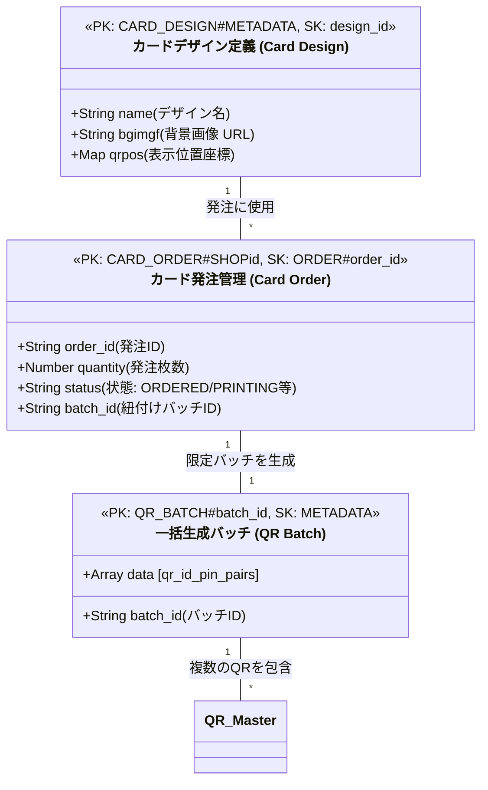
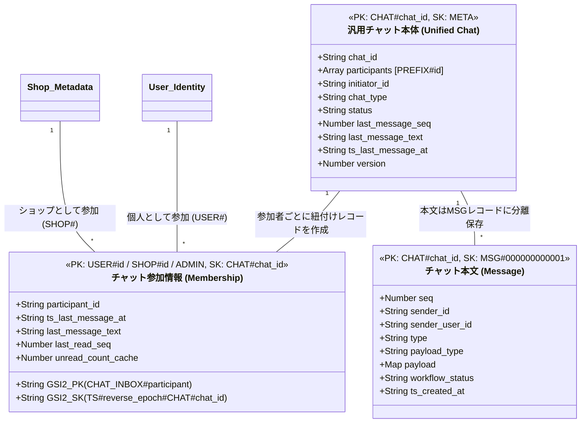
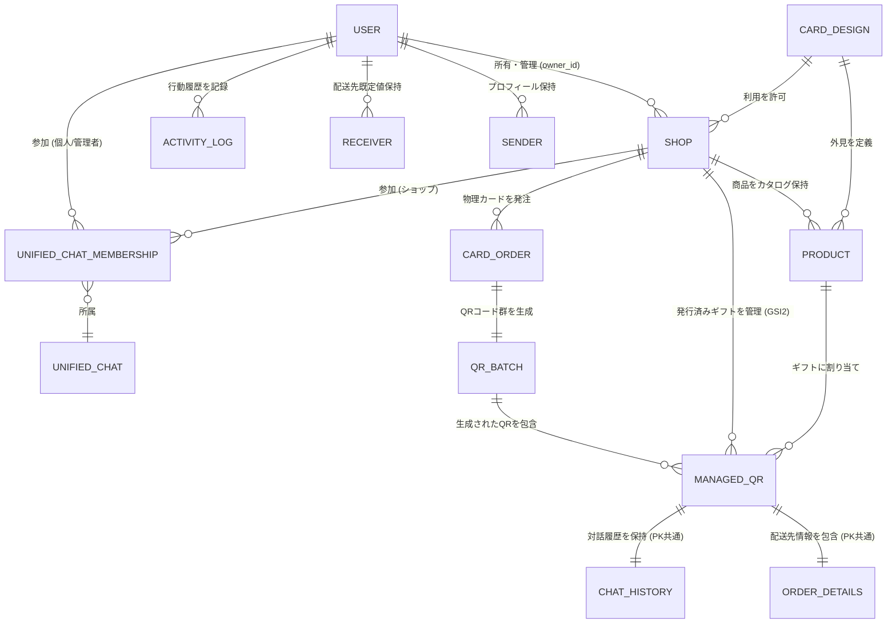

# REF Data Structure (Role-Based)

このドキュメントでは、システムの主要なエンティティ間の関係を、操作の主体（ロール）ごとの視点で可視化しています。

---

## 1. User-Centric (ユーザー・履歴視点)

ユーザー（送り主・受取人）自身のアイデンティティと、プロフィール・設定・行動履歴に関連する構造です。

---

## 2. Shop-Centric (ショップ・在庫管理視点)

ショップ運営者が管理する、店舗情報、商品カタログ、および紐付くギフト（QR）の構造です。

---

## 3. QR-Centric (取引・注文ハブ視点)

ギフト（QRコード）を核とした、受取人との取引、配送、およびコミュニケーションの構造です。

---

## 4. Admin-Centric (システム・マスタ管理視点)

システム管理者が扱う、デザイン定義、物理カードの発注、および一括生成バッチの構造です。

---

## 6. Unified Communication (汎用対話・サポート視点)

QRコードに依存しない、システム管理者（Admin）、ショップ（Shop）、一般ユーザー（User）間の対話構造です。

---

## 5. Overall ER Diagram (全体的な実体関連図)

システム全体のエンティティ間の接続性と多重度（カーディナリティ）を俯瞰する全体図です。

