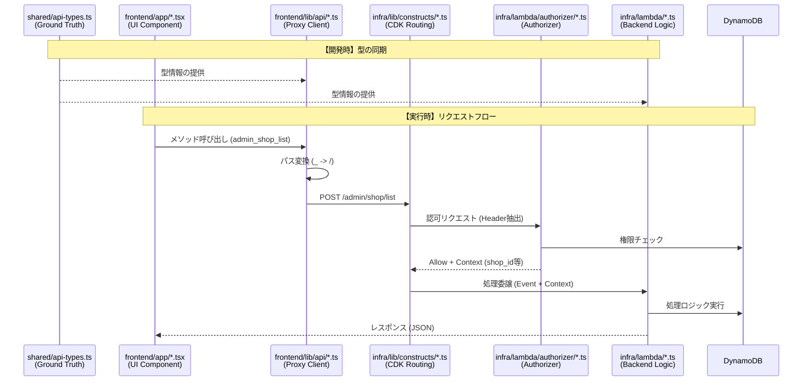
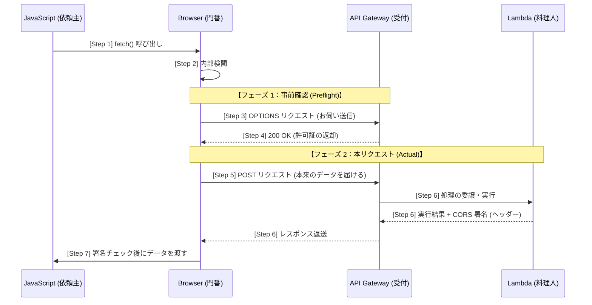

# API Gateway 実装仕様と開発ガイド

このプロジェクトにおける API の入り口である「**Amazon API Gateway**」について、その技術的な構成（仕様）と、開発者が実際に API を作成・管理するための手順（ガイド）を解説します。

---

## 第一部：開発ガイド・ワークフロー (Developer Guide)

開発者が実際に手を動かす際の手順やルールを説明します。

フロントエンドからバックエンドまで、リクエストがどのファイルをどの順序で通過していくのか、また型定義の「正解 (Ground Truth)」がどこにあるのかを可視化します。
編集するファイルを探し出すときの参考にしてください。

### ０. API 処理フローとファイルの対応（外観）
リクエストは常に以下の流れに従って処理されます。

0.  **Ground Truth** ([`shared/api-types.ts`](../shared/api-types.ts))
    - **全ての基準となる型定義**。このファイルの定義を元に、各レイヤーの整合性が保たれます。
1.  **Frontend API Client** (`frontend/lib/api/*.ts`)
    - 各種プロキシ経由でバックエンドを呼び出します。
2.  **Infra / CDK** (`infra/lib/constructs/*-api.ts`)
    - API Gateway のパス定義と Lambda へのルーティングを行います。
3.  **Lambda Function** (`infra/lambda/*.ts`)
    - 各エンドポイントに対応した個別のビジネスロジックを実行します。

### 1. API 処理フローとファイルの対応（詳細）

##### A. ファイル横断シーケンス図


##### B. レイヤー別ファイルパス対応表
開発時に「どこを修正すればよいか」を判断するためのマップです。

| レイヤー / 役割 | 実際のディレクトリパス | 内容・役割 | 編集タイミング |
| :--- | :--- | :--- | :--- |
| **Ground Truth (GT)** | `shared/api-types.ts` | **フロントエンド・バックエンドが参照するAPIの正しい定義**。API 名、リクエスト/レスポンス型を定義。 | 新たな Lambda (API) を追加する際。まずはじめにこのファイルに必要な引数や返り値の型を定義します。 |
| **UI / Components** | `frontend/app/`, `frontend/components/` | API 処理のトリガー。Web ページ上の JavaScript。`shopApi.xxx()` のように API を呼び出す。 | 画面の見た目や、新しい API 呼び出し処理を画面に追加する際。 |
| **API Proxy** | `frontend/lib/api/` | フロントエンド側の通信の窓口（引数の型チェックを実施）。メソッド名を URL に変換し、認証トークンを付与して Fetch を実行。 | 普通操作は不要。これは新たな API を追加した際もshared/api-types.tsを参考に自動生成されるため。しかしながら新しい認証設定やロールなどでAPIのグループが新しくできた場合は、既存ファイルを参考にソースファイルの新規追加が必要。 |
| **CDK Routing** | `infra/lib/constructs/` | バックエンド側の通信の窓口である API Gateway の定義（URL パスと Lambda 関数の紐付け）。 | 新たな Lambda を追加した際に、その Lambda を呼び出すための URL パスを設定する際。 |
| **Authorizer** | `infra/lambda/authorizer/` | 認可ロジック。ゲートウェイ層で不正アクセスを遮断。 | 新たなロールや認証条件が必要なページ・機能が追加された際。 |
| **Backend Logic** | `infra/lambda/` | 処理ロジック (Lambda)。Ground Truth の型に従ってリクエストを処理。 | データベース操作などバックエンドの具体的な処理を変更・新規追加する際。 |

---

### 2. API (Lambda 関数) 追加の具体的手順
新しい API を追加する際は、情報の源泉である Ground Truth (GT) から順に、以下の 5 つのステップに従って各レイヤーのファイルを編集してください。

#### Step 1: 共有型定義 (Ground Truth) の更新
**ファイル**: [**shared/api-types.ts**](../shared/api-types.ts)
**タイミング**: 新たな API (Lambda) を追加する際、最初に行います。

- 各 API スキーマ（`AdminApiSchema`, `ShopApiSchema` 等）に新しいメソッド名と、そのリクエスト引数・レスポンスの型を追加します。
- これを行うことで、フロントエンドとバックエンドの両方で型補完と静的チェックが有効になります。

#### Step 2: バックエンドロジック (Lambda) の実装
**ファイル**: [**infra/lambda/*.ts**](../infra/lambda/)（新規作成）
**タイミング**: 型定義が完了した後、実際のビジネスロジック(Lambda)を実装します。

- **ファイル名**: `snake_case` (例: `shop_products_list.ts`)。アンダーバー(_)がそのままAPIのURLのパス区切り(/)になります。
- **型安全性の確保**: Step 1 で定義した型で `event.body` をキャストし、`any` 型を排除します。
- **一貫したレスポンス**: `infra/lambda/utils/response.ts` の `apiResponse` ユーティリティを使用して結果を返します(CORS対応のため)。
- **JSDoc とコメント**: ファイル冒頭に仕様（引数、戻り値、処理目的）を記述し、DB 操作（DynamoDB）箇所には PK/SK や目的を明記してください。

#### Step 3: インフラ (CDK) のルーティング定義
**ファイル**: [**infra/lib/constructs/*-api.ts**](../infra/lib/constructs/)
**タイミング**: Lambda 関数のファイルが作成された後、URL パスと紐付けます。

- `lampath` を使用して Step 2 で作成した関数のファイルパスを指定します。
- `grantTablePermissions` 等で必要なデータベース操作権限を付与します。
- `.addResource(...)` と `addMethod('POST', ...)` を使い、URL パス（例: `/shop/products/list`）を構築し、Lambda 関数をAPIGatewayに登録します。

#### Step 4: フロントエンド プロキシへの登録
**ファイル**: [**frontend/lib/api/*.ts**](../frontend/lib/api/)
**タイミング**: 通常は操作不要です。

- 通常は編集不要です。このコードは `shared/api-types.ts`の`ShopApiSchema` などを参考に関数を自動定義します。 新しい API カテゴリ（新しいロールや認証条件）を作成した場合は、既存ファイルを参考に新規に自動生成をするためのコードを作成する必要があります。

#### Step 5: UI コンポーネントでの呼び出し
**ファイル**: [**frontend/app/**](../frontend/app/), [**frontend/components/**](../frontend/components/)
**タイミング**: 全ての準備が整った後、画面から呼び出します。

- `await shopApi.method_name({ ... })` の形式で呼び出します。
- Step 1 で定義した型により、IDE 上での自動補完と、不整合時のビルドエラー検知が機能します。

上記の変更はバックエンドの変更であるため，cdk deploy コマンドによるバックエンドのデプロイ(検証または本番環境)が必要です

---

### 3. API 実装ルールと命名規則

全てコードを統一して管理を簡略化、バグを発見しやすくしセキュリティを向上するため、機械的な実装を可能としてコーディングを容易化するため、型安全による機械的なテストの実施を可能にするため、以下のようなルールとしています．

#### 💡 基本POSTのみ
基本はPOST通信のみです．また，ユーザーの利便性（お気に入り登録など）のためにパスにIDを含めていますが、パスパラメータ（`{shopId}`）は原則使用せず、リクエストボディ（JSON）に含めて送信します。
- **リクエスト**: `POST /shop/products/list`  Body: `{"shopId": "..."}`
- **Lambda 側**: `JSON.parse(event.body).shopId` で取得します。
- **Action 判別**: 1 つの Lambda で複数パスを処理する（複数の処理を分岐する）場合、`event.resource` を見てパスの最後のスラッシュから右にある文字列（`/list` 等）を使用します。

#### 🏷️ 命名規則とパスの自動マッピング
リクエストは「フロントエンド」「CDK（ルーティング）」「Lambda（ロジック）」の各レイヤーで以下の命名規則に従って同期されています。
- **Lambda 関数名/ファイル名**: `snake_case` (例: `admin_qr_generate.ts`)
- **パスの対応**: フロントエンドや Lambda のメソッド名に含まれるアンダースコア（`_`）が、API Gateway の URL パスにおけるスラッシュ（`/`）に対応します。これによってURLを機械的に定義しています。
  - **メソッド名/関数名**: `shop_products_list`
  - **API の URL パス**: `/shop/products/list`

---

### 4. API 静的型安全ガイド (Static Type Safety)
フロントエンドとバックエンドの API 不整合を、**ビルド時の型チェックで機械的に検知**する仕組みです。

#### 4.1 仕組みの概要
プロジェクトルートにある **[shared/api-types.ts](../shared/api-types.ts)** が「唯一の真実（Source of Truth）」です。フロントエンドの API クライアントと、バックエンドの Lambda 関数が同じ定義を参照することで、双方向の整合性を保証します。

#### 4.2 API 追加・変更の手順
1.  **共有型の更新**: `shared/api-types.ts` 内の適切な Schema に、型定義を追加します。
    ```typescript
    export type ShopApiSchema = {
        shop_new_feature: { param1: string; param2: number };
    };
    ```
2.  **Lambda 関数への適用**: Lambda 関数の冒頭で、定義した型を使って `body` をキャストします。
    ```typescript
    import { ShopApiSchema } from '@shared/api-types';

    // body のキャストにより、プロパティの型補完が効くようになる
    const body = JSON.parse(event.body || '{}') as ShopApiSchema['shop_new_feature'];

    // パラメータの取得
    const { param1, param2 } = body;
    ```
3.  **フロントエンドでの利用**: クライアントは自動的に定義を読み込み、型補完とチェックが働きます。
    - フロントエンドからは、`adminApi`, `shopApi`, `receiveApi` 等の**プロキシ経由**でメソッドを呼び出します。
    ```typescript
    import { shopApi } from '@/lib/api/shop';

    // ... コンポーネント内など
    const handleAction = async () => {
        // 定義済みのメソッド名（shop_new_feature）を呼び出すだけで
        // 自動的にパス（/shop/new/feature）が解決され、POST リクエストが送られる
        await shopApi.shop_new_feature({ param1: "test", param2: 123 }); // 型安全！
    };
    ```

#### 4.3 整合性の一括チェック方法
開発時やデプロイ前に以下を実行することで、全 API の整合性をチェックできます。
- **フロントエンド**: `cd frontend && npx tsc --noEmit`
- **バックエンド**: `cd infra && npx tsc --noEmit`

---

## 第二部：アーキテクチャ・仕様 (Specifications)

システムの構成や、採用されている設計思想について説明します。

### 5. API Gateway の概要と役割
フロントエンド（React/Next.js など）からの HTTP リクエスト（GET, POST など）を受け取り、適切なバックエンド処理（Lambda 関数）へ振り分ける「受付窓口」の役割を果たします。

このプロジェクトでは、主に以下の機能を API Gateway で設定しています。
1.  **ルーティング**: URL パス（例: `/shop`, `/admin`）に応じた Lambda の呼び出し
2.  **CORS 設定**: フロントエンド（異なるドメイン）からの安全なアクセス許可
3.  **認証 (Authorizer)**: ログイン済みユーザー（Cognito）のみアクセスできるルートの保護
4.  **ヘッダー正規化**: ブラウザやインフラによるヘッダーの揺れを防ぐための小文字統一定義

---

### 6. 認証 (Authorizer) ととの連携
本プロジェクトでは、API Gateway レイヤーで厳格なアクセス制御を行っています。

例えば「荷物の受け取り操作（Receive）」に関連する API では、**「受け取る荷物の QR ID」に加えて「正しい PIN コード」が提示されなければ、後続の処理は一切動作しない** という条件があります。この「条件の判定」を、バックエンドの業務ロジックに到達する前に API Gateway の **Custom Lambda Authorizer** が「門番」として実行しています。

これにより、不正なアクセスや総当たり攻撃を入り口で遮断し、セキュリティ要件（MFA の強制やカスタム権限チェック等）を満たすため、標準の Cognito Authorizer ではなく **Custom Lambda Authorizer (`RequestAuthorizer`)** を採用しています。

#### 6.1 ゲートウェイ層で認証を行う理由
バックエンド（Lambda）の内部ではなく、共通の入り口である API Gateway で認証・認可を行うのには、以下の重要な理由があります。

1.  **セキュリティの最大化 (境界防御)**: 不正なリクエストをバックエンドに到達する前に遮断します。業務ロジックを実行する前に「そもそも誰か」を確認することで、脆弱性攻撃の試行回数を減らし、安全性を高めます。
2.  **リソース保護とコスト最適化**: 認可されていないリクエストに対しては、バックエンドの Lambda を起動しません。これにより、不要な Lambda の実行コストやメモリ消費、データベースへの不要な負荷を完全に抑えることができます。
3.  **認証ロジックの共通化**: 各 API（Lambda）ごとに認証処理を実装すると、ロジックが重複し、修正漏れによるセキュリティホールが発生しやすくなります。ゲートウェイで集約することで、一貫したセキュリティポリシーを全エンドポイントに適用できます。
4.  **キャッシュによる高速化**: API Gateway は認可結果をキャッシュできます。頻繁にアクセスするユーザーに対して、毎回認可 Lambda を動かさずに済むため、全体のレスポンス速度が向上します。
5.  **バックエンドの疎結合化**: バックエンド Lambda は「認証済みであること」を前提に、ビジネスロジックの開発に専念できるようになります。

#### 6.2 Authorizer 一覧比較表

| 名前 | 認証ソース(Header) | 対象エンドポイント | 主な認可ロジック |
| :--- | :--- | :--- | :--- |
| **AdminAuthorizer** | `Authorization` | `/admin/*` | JWT 検証 + Administrators グループ + **MFA 必須** |
| **ShopAuthorizer** | `Authorization` | `/shop/*` | JWT 検証 + ショップの所有権（Owner/GM）確認 |
| **UserAuthorizer** | `Authorization` | `/user/*` | JWT 検証（ログイン済み確認） |
| **ReceiveAuthorizer** | `x-qr-id`, `x-qr-pin` | `/receive/*` | QR ID の存在確認 + ステータスチェック + PIN 一致確認 |

#### 6.3 後続 Lambda へのコンテキスト情報の継承 (Context Inheritance)

Custom Authorizer は単にアクセスを許可・拒否するだけでなく、検証過程で得られた信頼済みの情報を後続のビジネスロジック用 Lambda に安全に引き渡す役割を持っています。

*   **仕組み**: API Gateway上の Authorizer Lambda が返す `policyDocument` 内の `context` オブジェクトに値をセットします。
*   **利用方法**: バックエンドの Lambda 関数では、`event.requestContext.authorizer` からこれらの値を直接参照できます。
*   **メリット**: バックエンド側で再度同じ検証（DB 参照やトークン解析など）を行う必要がなく、パフォーマンスとセキュリティの向上につながります。

```typescript
// (Authorizer 側) 生成するポリシードキュメントへの context の追加
return {
  principalId: userId, // ユーザー識別子
  policyDocument: { ... },
  context: { 
    shop_id: "SHOP#123",  // 検証済みの値をセット
    user_id: "USER#abc"
  }
};
const shopId = event.requestContext.authorizer.shop_id;
```

#### 6.4 各 Authorizer の詳細仕様

##### 🛡️ AdminAuthorizer
システム管理者向けの厳格な認可を行います。
実際の定義箇所: [../infra/lambda/authorizer/adminAuthorizer.ts](../infra/lambda/authorizer/adminAuthorizer.ts)
- **認可条件**: 
  - 有効な JWT (ID Token) であること
  - Cognito グループ `Administrators` または `GlobalAdmins` に属していること
  - **MFA（多要素認証）を通過していること** (AMR 値を検証)
- **バックエンドへの継承 (`context`)**: `is_global_admin`, `is_admin`, `email`, `user_id`

##### 🏪 ShopAuthorizer
店舗運営者向けの認可を行います。リクエストされたショップに対する操作権限があるかを動的に判定します。
実際の定義箇所: [../infra/lambda/authorizer/shopAuthorizer.ts](../infra/lambda/authorizer/shopAuthorizer.ts)
- **認可条件**: 
  - 有効な JWT (ID Token) であること
  - パスパラメータの `shopId` に対して、ユーザーが `Owner` または `GM` であること（DynamoDB を参照）
- **バックエンドへの継承 (`context`)**: `shop_id`, `is_global_admin`, `email`, `user_id`

##### 👤 UserAuthorizer
一般ユーザー向けの認可を行います。
実際の定義箇所: [../infra/lambda/authorizer/userAuthorizer.ts](../infra/lambda/authorizer/userAuthorizer.ts)
- **認可条件**: 
  - 有効な JWT (ID Token) であること（有効期限や署名の検証）
- **バックエンドへの継承 (`context`)**: `email`, `user_id`, `groups`

##### 🎁 ReceiveAuthorizer
荷物の受け取り（ギフト受信者）向けの認可を行います。ユーザーログインの有無にかかわらず、QRコードとPINを知っていることをアクセス権とみなします。
実際の定義箇所: [../infra/lambda/authorizer/receiveAuthorizer.ts](../infra/lambda/authorizer/receiveAuthorizer.ts)
- **認可条件**: 
  - `x-qr-id` に該当するデータが DB に存在すること
  - `x-qr-pin` が DB の PIN と一致すること
  - QR のステータスが有効（LOCKED 状態でない等）であること
- **バックエンドへの継承 (`context`)**: `qr_id`, `pin`, `status`, `shop_id`, `user_id` (任意)

#### 💡 なぜ認証パラメータは「ヘッダー」なのか？
認証情報をリクエストボディ（JSON）ではなくヘッダーに含めるのは、以下の技術的・設計的理由によります。

1.  **API Gateway の制約 (Identity Sources)**: Lambda Request Authorizer はリクエストボディを直接参照できません。ゲートウェイ層で認可を行うには、`Identity Sources` として指定可能なヘッダーやクエリ文字列に値を含める必要があります。
2.  **キャッシュの最適化**: AWS はヘッダー値をキーにして認可結果をキャッシュします。これにより、同じユーザーからの連続したリクエストに対して Authorizer を再実行せず、高速に「許可」を返せます。
3.  **関心の分離**: 「誰がアクセス可能か（認可）」と「どのような処理を行うか（業務ロジック）」を分離します。ボディは純粋な業務データのみを扱い、認証メタデータはヘッダーが受け持ちます。
4.  **セキュリティ (ログ対策)**: クエリ文字列（URL）はサーバーやプロキシのログに残りやすいですが、ヘッダーは通常ログに記録されないため、PIN などの機密情報の漏洩リスクを低減できます。
5.  **コンテキストの継承**: Authorizer で検証した結果（`qr_id` 等）は、`context` を介して後続の Lambda へ安全に引き渡され、`event.requestContext.authorizer` から信頼できる値として参照可能です。

---

### 7. CORS 実装の論理構造とリクエストフロー
ブラウザには「あるサイト（ドメイン）から取得したスクリプトは、別のドメインに対して自由に通信してはいけない」というセキュリティ規則（**Same-Origin Policy**）があります。

このプロジェクトでは、フロントエンド（`meishigawarini.com`）とバックエンド（`execute-api.ap-northeast-1.amazonaws.com`）の **ドメインが異なる** ため、ブラウザはこの規則に基づき通信を制限しようとします。これに対応し、安全に通信を許可するための仕組みが **CORS (Cross-Origin Resource Sharing)** です。

ここでは、API Gateway と Lambda の二段階で CORS 制御をどのように同期させているかを、実際の通信フローに沿って解剖します。

#### 7.1 リクエストの徹底解剖：4 つの登場人物と 7 つのステップ
一つの API 呼び出しに対し、裏側では「誰が・いつ・何の目的で」動いているのかを整理します。

##### 登場人物 (Actors)
1.  **JavaScript (開発者が書いたコード)**: データを送りたい「依頼主」。
2.  **ブラウザ (実行エンジン)**: 通信を監視し、セキュリティを守る「厳格な門番」。
3.  **API Gateway (インフラ)**: API の入り口にある「受付窓口」。
4.  **Lambda (バックエンド)**: 実際にデータベースなどを操作する「作業者」。

##### 視覚的な流れ（シーケンス図）


##### 時系列ステップ詳細
| 順序 | 実行者 | 通信先 (どこに) | 内容 | 目的 | 設定場所 |
| :--- | :--- | :--- | :--- | :--- | :--- |
| **Step 1** | **JavaScript** | **ブラウザ内部** | `fetch()` を実行 | 通信の依頼 | - |
| **Step 2** | **ブラウザ** | **ブラウザ内部** | 通信を一時停止し、内容を検閲 | カスタムヘッダー等があるか確認 | - |
| **Step 3** | **ブラウザ** | **API Gateway** | **Preflight (`OPTIONS`) 送信** | 通信許可の事前確認 | **自動実行** |
| **Step 4** | **API Gateway** | **ブラウザ** | 「許可証」を返却 | ブラウザへの許可回答 | **infra-stack.ts** |
| **Step 5** | **ブラウザ** | **API Gateway** | **本来のリクエスト (`POST`) 送信** | 実際のデータ送信 | **本番通信** |
| **Step 6** | **Lambda** | **ブラウザ** | 処理を実行し、結果を返却 | 業務ロジックの実行 | **lambda/*.ts** |
| **Step 7** | **ブラウザ** | **JavaScript** | **最終検閲・データの引き渡し** | 結果の読み取り許可確認 | **response.ts** |

#### 7.2 二段階の承認プロセス：API Gateway と Lambda
上記の設定ステップを見ると分かる通り、**「入場許可（API Gateway 側）」**と**「閲覧許可（Lambda 側）」**という、目的の異なる二段階の承認を通らなければなりません。

1.  **API Gateway 側の役割 (Preflight 応答用)：サーバーに到達させるための「入場許可」**
    - Step 4 で機能します。ブラウザが送った「打診（`OPTIONS`）」に対し、API Gateway が即答します。
    - **設定ミスの場合**: ブラウザは Step 5 に進まず、通信をその場で破棄します。**サーバー側（Lambda）は 1 ミリも動きません。**

2.  **Lambda 側の役割 (Actual Response 用)：結果を JS に渡すための「閲覧許可（署名）」**
    - Step 7 で機能します。Lambda が処理を終え、API Gateway 経由でブラウザにデータが戻ってきた瞬間にチェックされます。
    - **設定ミスの場合**: **サーバー側（Lambda）では処理が正常に終わっている（例：DBが更新されている）のに、ブラウザが結果を隠蔽し、JavaScript には「エラー」として渡します。** これにより、画面上は「失敗」なのに裏では「成功」しているという、深刻な不整合が発生します。

---

#### 7.3 `shared/constants.ts` による整合性の担保
API Gateway と Lambda の設定が 1 文字でもズレると（例：許可すべきカスタムヘッダー `x-qr-id` の漏れ）、ブラウザは直ちにエラーを出します。これを防ぐため、[`shared/constants.ts`](../shared/constants.ts) を唯一のソースとして共有しています。

- **API Gateway (infra-stack.ts)**: API 構築時に共通定数を読み込み、事前許可（Preflight）設定を自動生成します。
- **Lambda (response.ts)**: 実行結果の返却時に共通定数を読み込み、本レスポンス（Actual Response）に署名として付与します。

##### A. API Gateway 側の設定 (Preflight)

**1. 概念的な定義例（API 全体のポリシー設定）**
このプロジェクトでは、API Gateway 全体で許可すべきヘッダーを一貫させる設計をとっています。
実際の定義箇所: [infra/lib/infra-stack.ts](../infra/lib/infra-stack.ts)

```typescript
// infra/lib/infra-stack.ts
const api = new apigateway.RestApi(this, 'MeishiGawariniApi', {
  defaultCorsPreflightOptions: {
    allowOrigins: allowedOrigins,
    allowMethods: apigateway.Cors.ALL_METHODS,
    allowHeaders: SHOP_ALLOW_HEADERS, // 共有定数による厳格な定義
  },
});
```

**2. 実際の実装例（ヘルパー関数によるリソースごとの定義）**
実際のコードベースでは、リソース（URL パス）を追加する際に CORS 設定が漏れるのを防ぐため、以下のヘルパー関数を使用しています。
実際の定義箇所: [infra/lib/constructs/shop-api.ts](../infra/lib/constructs/shop-api.ts) など

```typescript
// /infra/lib/constructs/shop-api.ts

// リソース作成と同時に共通定数から CORS を設定するヘルパー
const addResourceWithCors = (parent: apigateway.IResource, pathPart: string): apigateway.Resource => {
  const res = parent.addResource(pathPart) as apigateway.Resource;
  res.addCorsPreflight({
    allowOrigins: allowedOrigins,
    allowMethods: apigateway.Cors.ALL_METHODS,
    allowHeaders: SHOP_ALLOW_HEADERS, // 共有定数を使用
  });
  return res;
};

// 実際の利用例：
// /shop/list というリソースを作りつつ CORS を設定し、POST メソッドを追加する
addResourceWithCors(shopResource, 'list').addMethod('POST', integration, routeOptions);
```

##### B. Lambda 側の設定 (Actual Response)
実際の定義箇所: [infra/lambda/utils/response.ts](../infra/lambda/utils/response.ts)

**重要**: CORS ヘッダーの漏れを防ぐため、全ての Lambda 関数は必ずこのユーティリティ（`apiResponse`, `successResponse`, `errorResponse` 等）を介して結果を返却しなければなりません。
```typescript
// infra/lambda/utils/response.ts
import { ALL_ALLOW_HEADERS, joinHeaders } from '../../../shared/constants';

// レスポンスに付与する CORS ヘッダーを生成するユーティリティ
export const getCorsHeaders = (methods: string = 'GET,POST,OPTIONS') => ({
    'Access-Control-Allow-Origin': '*',
    'Access-Control-Allow-Headers': joinHeaders(ALL_ALLOW_HEADERS), 
    'Access-Control-Allow-Methods': methods
});

// 全てのレスポンスはこの関数を介して返却される
export const apiResponse = (statusCode: number, body: any, methods: string = 'GET,POST,OPTIONS') => {
    return {
        statusCode,
        headers: getCorsHeaders(methods),
        body: JSON.stringify(body),
    };
};
```

#### 7.5 特殊なルールと対策

##### ヘッダーの小文字統一ポリシー
実際の定義箇所: [constants.ts](../shared/constants.ts), [request.ts](../infra/lambda/utils/request.ts)

ブラウザや API Gateway 経由のリクエストでは、ヘッダー名が正規化（`Authorization` -> `authorization` 等）されることがあります。これを防ぐため、以下の設計を採用しています。
1.  **定義の集約**: `shared/constants.ts` にて、全ての許可ヘッダーを**完全小文字**で定義しています。
2.  **大文字・小文字を問わない取得**: リクエストヘッダーを受け取る際は、ヘルパー関数 `getHeader` を使用します。これにより、クライアントが大文字で送ってきても小文字で送ってきても、安全に値を取得できます。

実際の定義箇所: [infra/lambda/utils/request.ts](../infra/lambda/utils/request.ts)
```typescript
// infra/lambda/utils/request.ts
export const getHeader = (headers: any, key: string) => {
    const lowerKey = key.toLowerCase();
    const actualKey = Object.keys(headers).find(k => k.toLowerCase() === lowerKey);
    return actualKey ? headers[actualKey] : undefined;
};
```

3.  **Lambda での利用**: バックエンドの `getCorsHeaders` ユーティリティも同じ定数を参照し、一貫した小文字ヘッダーを生成します。

##### 特殊な例外対策 (Gateway Responses)
実際の定義箇所: [infra-stack.ts](../infra/lib/infra-stack.ts)

認証エラー（401）などで Lambda に到達する前に API Gateway がエラーを返す場合、デフォルトでは CORS ヘッダーが付与されず、フロントエンドで原因不明の CORS エラーになります。これを防ぐためにレスポンスをカスタマイズしています。

実際の定義箇所: [infra/lib/infra-stack.ts](../infra/lib/infra-stack.ts)
```typescript
// infra/lib/infra-stack.ts
api.addGatewayResponse('Default401Response', {
  type: apigateway.ResponseType.UNAUTHORIZED,
  statusCode: '404',
  responseParameters: {
    'gatewayresponse.header.Access-Control-Allow-Origin': "'*'",
    'gatewayresponse.header.Access-Control-Allow-Headers': `'${joinHeaders(ALL_ALLOW_HEADERS)}'`,
    'gatewayresponse.header.Access-Control-Allow-Methods': "'GET,POST,PUT,DELETE,OPTIONS,PATCH'",
  },
  templates: { 'application/json': '{"message": "Not Found."}' }
} as any);
```

---

### 8. フラットなアクションベースのルーティング設計
以前の設計（RESTful なパスパラメータ `/shop/{id}/...`）から、**フラットなアクションベースの POST エンドポイント**へ移行しました。

#### 設計のメリット
- API パスが単純明快になり、フロントエンドからの呼び出し (`fetch_post`) が統一できる。
- パスパラメータのパースミスや、CORS のワイルドカード問題（サブパスの網羅漏れ）を回避できる。
- 全てのアクションを `POST` で統一することで、パラメータの隠蔽性が向上する。

#### 実装例
各リソースに対して具体的なアクション（`list`, `create`, `get`, `update` 等）をサブパスとして定義し、Lambda 関数を統合します。

実際の定義箇所: [infra/lib/constructs/shop-api.ts](../infra/lib/constructs/shop-api.ts)
```typescript
// infra/lib/constructs/shop-api.ts
// /shop/products リソースの定義例
const productsResource = addResourceWithCors(this.shopResource, 'products'); 

// 各アクションをサブパスとして定義
addResourceWithCors(productsResource, 'list').addMethod('POST', integration, routeOptions);
addResourceWithCors(productsResource, 'create').addMethod('POST', integration, routeOptions);
addResourceWithCors(productsResource, 'update').addMethod('POST', integration, routeOptions);
```

---
## 第三部：リファレンス (References)

#### ⚠️ 例外構成：1つのLambdaで複数エンドポイントを処理する場合のルーティング注意事項

このプロジェクトの原則は **「1 Lambda = 1 API エンドポイント」** ですが、`unified_chat.ts` のように
1つの Lambda が複数エンドポイント（`/create`, `/list`, `/get`, `/messages/get` など）を処理する
例外的な構成を取る場合があります。このような構成では、Lambda 内部のパス判定に細心の注意が必要です。

> [!WARNING]
> **`endsWith()` / `includes()` などの部分一致によるルーティングは絶対に使用しないでください。**
>
> **実際に発生した障害（2026年4月）の事例：**
> ```typescript
> // ❌ 問題のあったコード（部分一致）
> // path.endsWith('/get') は "/unified/chat/messages/get" にもマッチしてしまう!
> else if (path.endsWith('/get')) {
>     action = 'get';               // /messages/get もここで捕捉されてしまう
> } else if (path.endsWith('/messages/get')) {
>     action = 'messages_get';      // ← 永遠に到達しないコード
> }
>
> // ✅ 修正後（=== による完全一致）
> // event.resource に API Gateway が設定する完全パスと完全一致で判定する
> if (path === '/unified/chat/messages/get') {
>     action = 'messages_get';      // 具体的なパスを先に判定
> } else if (path === '/unified/chat/get') {
>     action = 'get';
> }
> ```
>
> この障害により `/unified/chat/messages/get` への全リクエストが `getChat()` として処理され、
> チャットメッセージが取得できない状態になりました。その結果、フロントエンドでは審査結果が
> 全件「審査中」と表示され続けるという不具合が本番環境で発生しました。

**なぜ `event.resource` の完全一致が安全なのか：**

| フィールド | 内容 | 利用推奨 |
|-----------|------|---------|
| `event.resource` | API Gateway が設定する「定義されたパスパターン」。パスパラメータは `{id}` のままプレースホルダー表記になる | ✅ **完全一致判定に使用** |
| `event.path` | 実際のリクエストパス。パスパラメータは実値に置換されている | ⚠️ パスパラメータがある場合は resource と異なる |

```typescript
// ✅ 推奨パターン：event.resource で完全一致させる
const path = event.resource || event.path || '';

if (path === '/unified/chat/messages/get') {
  action = 'messages_get';   // 具体的なパスを先に
} else if (path === '/unified/chat/get') {
  action = 'get';
} else if (path === '/unified/chat/list') {
  action = 'list';
}
// ・完全一致なので本来は順序不問だが、可読性のために具体的（長い）パスを先に書くことを推奨
```

参照: [infra/lambda/unified_chat.ts](../infra/lambda/unified_chat.ts)

---
詳細な情報やコードへのクイックアクセス。

### 9. 実装詳細：フロントエンドとインフラの連携定義

#### 9.1 フロントエンド プロキシクライアント
メソッド名がどのように URL パスへマッピングされるかのコアロジックです。
実際の定義箇所: [frontend/lib/api/shop.ts](../frontend/lib/api/shop.ts)

```typescript
// frontend/lib/api/shop.ts

function createShopApi<T extends Record<string, any>>(base: typeof shopApiBase) {
    return new Proxy(base, {
        get(target, prop: string) {
            if (prop in target) return (target as any)[prop];
            
            // 重要：アンダースコアをスラッシュに置換してパスを生成する
            // 例: shop_products_list  => /shop/products/list
            const path = "/" + (prop as string).replace(/_/g, "/");
            
            // 自動的に POST リクエストを生成して返却する
            return (data: any) => (target as any).fetch_post(path, data);
        }
    }) as typeof shopApiBase & { [K in keyof T]: (data: T[K]) => Promise<any> }
}
```

#### 9.2 API Gateway ルーティング (CDK)
フロントエンド側のパス（スラッシュ区切り）に合わせ、CDK でリソースを階層構造で定義します。
実際の定義箇所: [infra/lib/constructs/shop-api.ts](../infra/lib/constructs/shop-api.ts) など

```typescript
// /infra/lib/constructs/shop-api.ts

// 1. 親リソースの作成 (/shop/products)
const productsResource = addResourceWithCors(this.shopResource, 'products'); 

// 2. 子アクションの作成とメソッド定義 (/shop/products/list)
// フロントエンドの shop_products_list という呼び出しと正確に一致するように構成
addResourceWithCors(productsResource, 'list').addMethod('POST', integration, routeOptions);
```

### 10. クイックアクセス

*   **API エンドポイント一覧 ([REF_API_ENDPOINTS.md](./REF_API_ENDPOINTS.md))**: 全カテゴリのアクションが網羅されています。
*   **インフラ定義 (CDK) ([infra-stack.ts](../infra/lib/infra-stack.ts))**: Authorizer の設定やリソースのネスト構造が定義されています。
*   **共有型定義 (Ground Truth) ([shared/api-types.ts](../shared/api-types.ts))**: 全 API のリクエスト/レスポンス型。
*   **認証設定 (Authorizers) ([infra/lambda/authorizer/](../infra/lambda/authorizer/))**: 各ロールの認可ロジックの実装。
