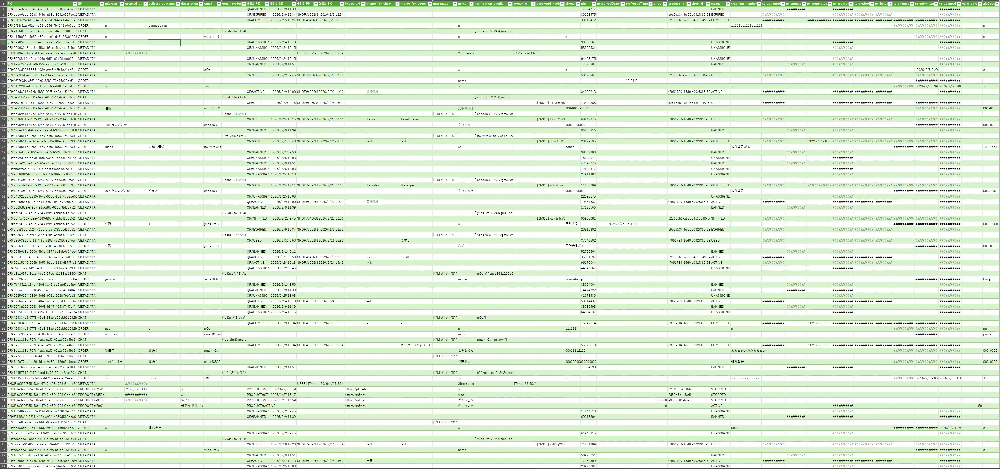

# DynamoDB データ設計ガイド

このプロジェクトのデータベースである「**Amazon DynamoDB**」について、基本的な考え方から、実際のプロジェクトでどのようにデータを保存しているかまでを初心者向けに解説します。

---

## 1. DynamoDBとは？
DynamoDBは、AWSが提供する**NoSQL型（非リレーショナル）のデータベース**です。
Excelのような「綺麗な表の形」でデータを管理する一般的なデータベース（MySQLなど）とは異なり、**「大量のアクセスがあってもどんなデータでも一瞬で取り出せる」**ことに特化しています。

### 最大の特徴：キーとバリュー
DynamoDBでは、データを引き出すための「カギ（Key）」と、そこに入っている「中身（Value）」がセットになっています。
このプロジェクトでは、主に以下の2つのカギを組み合わせてデータを特定します。

*   **PK (Partition Key / パーティションキー)**: データが入っている「大きな箱」の名前。(基本的にこの値で取得する)
*   **SK (Sort Key / ソートキー)**: 箱の中にある「個々のデータ」の並べ方。 (直近の50個だけとか持ってくる時にこの順番が活きてくる)

---

## 2. 「シングルテーブル設計」という考え方
一般的なデータベースでは、「ショップ一覧の表」「商品一覧の表」「注文一覧の表」のように、データごとに別々の表（テーブル）を作ります。

しかし、DynamoDBを最速・最安で使うためのベストプラクティスとして**「シングルテーブル設計（Single Table Design）」**という手法があります。
これは**「全く形の違うデータでも、工夫して全部1つの巨大なテーブルに突っ込む」**という特殊な設計です。
本プロジェクトも `MeishiGawariniTableV2` という1つのテーブルだけですべてのデータを管理しています。

**[実際のデータのイメージはこちら](./data/sampletabledata.csv)**

---

## 3. データの保存形式と代表的なパターン

1 つのテーブルに多種多様なデータを混在させるため、PK と SK の「命名規則」でデータを分類しています。ここでは、シングルテーブル設計のメリットを活かした代表的なパターンを紹介します。

> [!TIP]
> **全てのエンティティ（ユーザー、ショップ、チャット履歴等）の一覧と、各項目の具体的な属性（型やフィールド名）については、以下のリファレンスを参照してください。**
> 👉 **[データベース仕様および操作一覧 (REF_DB_SCHEMA.md)](./REF_DB_SCHEMA.md)**

### 🏢 パターン A: 親子関係の一括取得 (Shop & Product)

### 🏢 ① ショップの情報 (Shop)
*   **PK**: `SHOP#<ショップのID>`
*   **SK**: `METADATA` (基本情報), `DETAIL_HTML` (HTML説明文), `SETTINGS#SHIPPING_LABEL` (印刷設定)
> **データ分離の理由**: DynamoDBの1レコードあたりのサイズ上限（400KB）対策、および更新時の競合を避けるため、肥大化しやすいHTML文や、特定の機能専用の設定項目はSKを分けて保存しています。

### 📦 ② 商品の情報 (Product)
「この商品がどのショップのものか」を素早く検索できるよう、PK を親（ショップ）と同じにしています。
*   **PK**: `SHOP#<ショップのID>`
*   **SK**: `PRODUCT#<商品のID>`
> **メリット**: PK に `SHOP#1234` を指定して検索するだけで、ショップ情報（`METADATA`）とそのショップが持つ全商品（`PRODUCT#...`）を一度に取得できます。

---

### 🏷️ パターン B: 関連情報の集約 (QR & Order)

### 🏷️ ③ QRコードの情報 (QR)
*   **PK**: `QR#<QRのID>`
*   **SK**: `METADATA`

### 🚚 ④ 注文・配送先の情報 (Order)
ユーザーが入力した配送先は、その QR コードと同じ箱（PK）の中に保存されます。
*   **PK**: `QR#<QRのID>`
*   **SK**: `ORDER`
> **メリット**: QR の ID をキーにするだけで、QR 自体の状態と入力された送り先をセットで取り出せます。

---

### 🎨 パターン C: 静的なメタデータ (Card Design)

### 🎨 ⑤ カードデザインの情報 (Card Design)
全体で共有されるデザイン定義などです。
*   **PK**: `CARD_DESIGN#METADATA`
*   **SK**: `<デザインのID>`

---

## 4. GSI (グローバルセカンダリインデックス) について

「PKで検索するのが一番速い」のがDynamoDBのルールですが、「ステータスが "ACTIVE" のQRを全部探したい」「自分が持っているショップを一覧で見たい」など、**PK以外の条件で検索したくなる**ことがあります。

これを解決するための「裏口（別の切り口の検索用カギ）」が **GSI** です。
このプロジェクトでは2つのGSIを用意しています。

### GSI1: 「状態や種類ごとの一覧」を見たいとき
ステータスによる絞り込み検索で使われます。
*   **GSI1_PK**: `QR#UNASSIGNED`, `QR#ACTIVE`, `QR#USED`, `PRODUCT#ACTIVE` などのステータス値を保存。
*   *(例: 管理画面で「未発送（USED）」のQRをズラッと一覧表示する時などに使います)*

### GSI2: 「逆引き」 をしたいとき
*   **ショップのオーナー検索**: `GSI2_PK` に `USER#<ユーザーID>` を保存。→ あるユーザーが持つ複数のショップを一発で探せます。
*   **ショップに紐づくQRの検索**: `GSI2_PK` に `SHOP#<ショップID>` を保存。→ そのショップ向けに発行された全QRのリストを一発で取得します。

---

## 5. 開発時の確認方法
実際のデータがどう入っているかイメージしにくい場合は、AWS マネジメントコンソールが便利です。

1. AWSコンソールで **「DynamoDB」** を検索。
2. 左メニューの **「テーブル」**（または **「項目を探索」**）を開く。
3. `InfraStack-stg-MeishiGawariniTableV2stg...` を選択すると、エクセルのような画面で「ステージ環境のデータベースにどのようなPKやSK、データが存在するか」を直接見ることができます。

---

## 6. 実際のテーブル名と詳細仕様

各環境で使用されている物理的なテーブル名と、詳細なデータ構造（スキーマ）の定義場所は以下の通りです。

### 🏢 環境別テーブル名（物理名）
AWSコンソール上で検索する際や、CLIで操作する際に使用します。

| 環境 | テーブル名 (Physical Name) |
| :--- | :--- |
| **ステージング (stg)** | `InfraStack-stg-MeishiGawariniTableV2stg...` |
| **本番 (prod)** | `InfraStack-MeishiGawariniTableV2...` |

### 📜 詳細スキーマ定義
データの型や属性、制約などの詳細な定義は、以下のドキュメントおよびコードに記載されています。

*   **ドキュメント**: **[データベース仕様および操作一覧 (REF_DB_SCHEMA.md)](./REF_DB_SCHEMA.md)**
    *   各エンティティ（ユーザー、ショップ、QR等）の具体的な属性名や型が網羅されています。
*   **インフラ定義 (CDK)**: [infra-stack.ts](../infra/lib/infra-stack.ts)
    *   PK/SKの設定やGSIの構成など、物理的な構造がコードとして定義されています。

---

## 7. プロジェクト内での DynamoDB 操作

本プロジェクトの各 Lambda 関数では、AWS SDK v3 の `DynamoDBDocumentClient` を使用して、型安全かつ直感的にデータを操作しています。

### 🛠️ 共通クライアントの利用
DB操作のロジックを簡素化するため、`infra/lambda/share/db.ts` で初期化された共有クライアント `ddb` を利用します。

```typescript
import { ddb, TABLE_NAME } from './share/db';
import { GetCommand, PutCommand, QueryCommand, UpdateCommand } from '@aws-sdk/lib-dynamodb';

// 基本的な呼び出しパターン
// await ddb.send(new Command({...}));
```

> [!TIP]
> **フールプルーフ設計**: 共有クライアントは `removeUndefinedValues: true` 設定が有効になっており、JavaScript の `undefined` を自動的に除外して保存エラーを防いでいます。

### 📝 代表的な操作構文

#### ① データの取得 (GetItem)
PK と SK を直接指定して1件のデータを取得します。
```typescript
const res = await ddb.send(new GetCommand({
    TableName: TABLE_NAME,
    Key: { PK: `SHOP#${shopId}`, SK: 'METADATA' }
}));
const item = res.Item;
```

#### ② 検索 (Query)
特定の PK に紐づく複数のデータや、GSI を使用した検索を行います。
```typescript
// SHOPに紐づく商品(PRODUCT#...)を前方一致で全件取得
const res = await ddb.send(new QueryCommand({
    TableName: TABLE_NAME,
    KeyConditionExpression: 'PK = :pk AND begins_with(SK, :sk)',
    ExpressionAttributeValues: { ':pk': `SHOP#${shopId}`, ':sk': 'PRODUCT#' }
}));

// GSI1 を使用して「使用済み」の QR を検索
const res = await ddb.send(new QueryCommand({
    TableName: TABLE_NAME,
    IndexName: 'GSI1',
    KeyConditionExpression: 'GSI1_PK = :pk',
    ExpressionAttributeValues: { ':pk': 'QR#USED' }
}));
```

#### ③ 更新 (UpdateItem)
既存のデータの一部だけを効率的に書き換えます。リストへの追加や、存在しない場合の初期値設定（`if_not_exists`）を多用します。
```typescript
await ddb.send(new UpdateCommand({
    TableName: TABLE_NAME,
    Key: { PK: `USER#${userId}`, SK: 'SHOP' },
    // リストの末尾に shopId を追加し、更新日時をセット
    UpdateExpression: 'SET owner_shop_ids = list_append(if_not_exists(owner_shop_ids, :empty), :new_id), ts_updated_at = :now',
    ExpressionAttributeValues: { ':new_id': [shopId], ':empty': [], ':now': now }
}));
```

#### ④ トランザクション (TransactWrite)
複数のレコードを「全て成功か、全て失敗か」の単位でアトミックに更新します。権限の譲渡など、整合性が重要な処理で使用します。
```typescript
import { TransactWriteCommand } from '@aws-sdk/lib-dynamodb';

await ddb.send(new TransactWriteCommand({
    TransactItems: [
        { Update: { /* Aの更新 */ } },
        { Update: { /* Bの更新 */ } },
        { Put: { /* Cの追加 */ } }
    ]
}));
```

### 💡 開発時のルール
*   **論理削除の徹底**: 商品やユーザーなどの重要なデータは `PutCommand` や `DeleteCommand` で物理削除せず、`status: 'DELETED'` への更新（論理削除）として扱います。
*   **タイムスタンプ**: 作成時には `ts_created_at`、更新時には `ts_updated_at` に ISO8601 形式の文字列（`new Date().toISOString()`）を必ず含めます。
*   **GSIの管理**: データ更新時、検索インデックスとなる `GSI1_PK`, `GSI1_SK` 等もセットで更新することを忘れないようにしてください。
