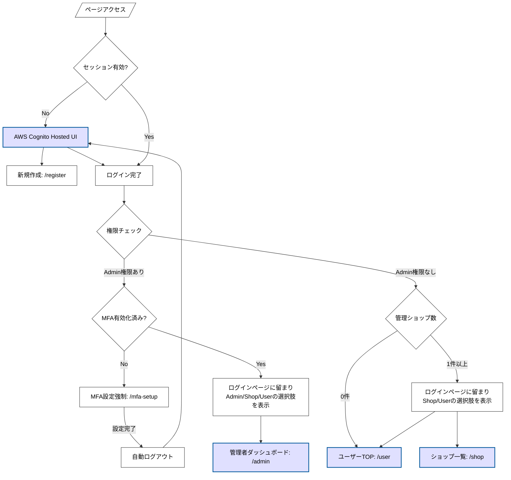
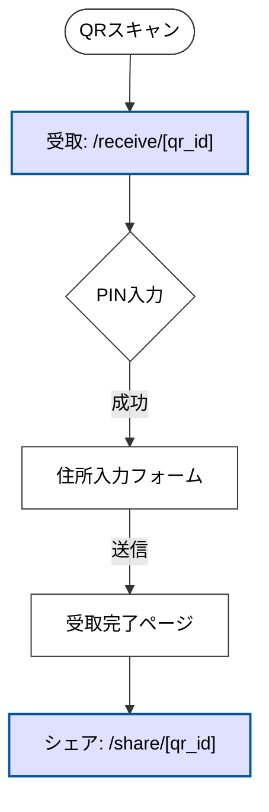
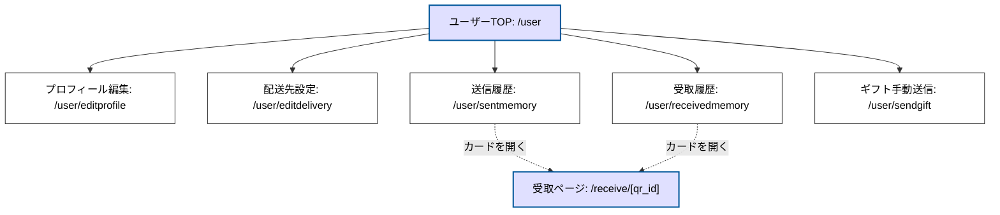
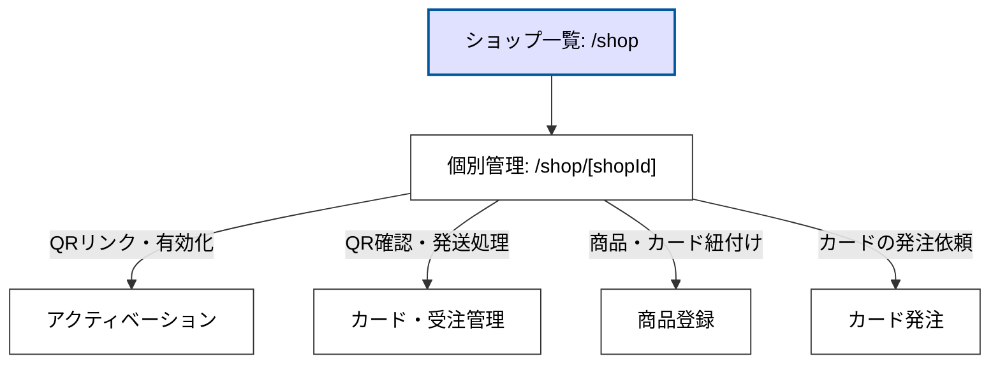
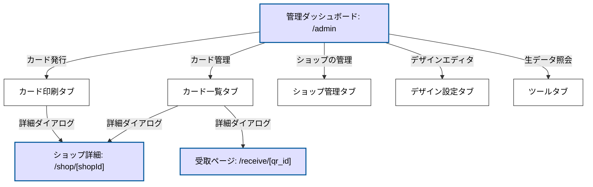

# 画面一覧とページ遷移・操作ガイド

本ドキュメントでは、「名刺代わりに」アプリケーションの主要な画面構成、代表的なページ URL、およびそれらの間での操作・遷移フローを定義します。

---

## ページ遷移の全体イメージ

アプリケーションは、ユーザーの役割や認証状態に応じて以下の5つの主要セクションに分かれます。

### 1. 認証・ログイン後の自動リダイレクト
認証状態やユーザー権限に基づき、最適なダッシュボードへ案内します。

### 2. 受取人・エンドユーザーフロー
QRコードをスキャンした直後の受取体験フローです。

### 3. User（アカウント保持者）フロー
一般ユーザーが自身のプロフィールや履歴を確認するフローです。

### 4. ショップ管理フロー
ショップのオーナーまたは店長が、自身が管理するショップの運営を行うフローです。

### 5. システム管理者フロー
プラットフォーム全体の運営管理者が、全ショップや全QRコードの監視・管理を行うフローです。

---

## ページ詳細と操作フロー

### 1. 認証・共通ページ

* **ログイン (`/login`)**
    * **未認証時の挙動**: 有効なセッションがない場合、自動的に **AWS Cognito Hosted UI (外部ログイン画面)** へリダイレクトされます。
    * **Hosted UI での操作**: 
        * 外部サービス（Amazon/Google等）連携ログイン。
        * パスワードを忘れた場合の再設定。
        * **新規アカウント登録**: 「Sign Up」からアプリの `/register` または Cognito 側の登録画面へ。
    * **アプリ内ログイン画面**: ID/PW の直接入力、および MFA コードの入力に対応。
    * **管理者向け MFA 強制フロー**:
        * システム管理者 (`Administrators` 等) が MFA 未設定状態で `/admin` 配下にアクセスしようとすると、自動的に `/mfa-setup` へリダイレクトされます。
        * MFA セットアップ完了後はセキュリティ確保のため、強制的にログアウトされ、再ログインを求められます。
    * **遷移先詳細**:
        * **システム管理者**: 管理者ダッシュボードへのアクセスが許可されます。
        * **ショップオーナー/店長**: 管理しているショップが1つ以上ある場合、ショップ一覧が表示されます。
        * **一般ユーザー**: 利便性のため、プロフィールや履歴を管理する `/user` へ自動リダイレクトされます。
* **新規登録 (`/register`)**
    * **操作**: アカウント作成後、自動的に `/verify` へ遷移。
* **アカウント認証 (`/verify`)**
    * **操作**: メール送信された6桁のコードを入力し、アカウントを有効化。
* **MFA設定 (`/mfa-setup`)**
    * **操作**: 管理者権限を持つユーザーが TOTP（認証アプリ）を登録。登録後は再ログインが必要。

### 2. ユーザー向けページ (Account Dashboard)

一般ユーザー（受取人・贈り主）としての情報を管理するセクション。セッション維持時は `/user` が拠点となります。

* **ユーザーTOP (`/user`)**
    * **概要**: 各機能へのナビゲーションタイルを表示.
* **プロフィール編集 (`/user/editprofile`)**
    * **操作**: 贈り主として表示される「デジタル名刺」情報を編集。
* **配送先設定 (`/user/editdelivery`)**
    * **操作**: ギフトを受け取る際のデフォルトの住所・氏名・電話番号を登録。
* **送信/受取履歴 (`/user/sentmemory`, `/user/receivedmemory`)**
    * **操作**: 過去に贈った・受け取ったギフトの一覧を表示。カードをクリック、または「カードを開く」ボタンから対象の **ギフト受取ページ (`/receive/[qr_id]`)** へ遷移し、メッセージやチャットを再確認できます。
* **ギフト手動送信 (`/user/sendgift`)**
    * **操作**: 手元にある QR コードをスキャン、または URL を入力し、自身のプロフィール（デジタル名刺）とギフトを紐付ける。

### 3. ショップ管理者向けページ

ショップのオーナーまたは管理者が商品管理や発送業務を行うセクション。

* **ショップ一覧 (`/shop`)**
    * **操作**: 管理権限を持つショップの一覧を表示. 1つの場合は自動リダイレクト。
    * **制限**: システム管理者 (Admin) のみが「新規ショップ作成」ダイアログを利用可能。
* **個別ショップ管理 (`/shop/[shopId]`)**
    * **[アクティベーション] (旧Activation) タブ**: カメラで QR をスキャンし、特定の商品と紐付けて有効化 (`ACTIVE`)。
    * **[カード・受注管理] (旧Shipping) タブ**: `USED` 状態の注文一覧を表示し、追跡番号を入力して `SHIPPED` へ更新。
    * **[商品登録] (旧Products) タブ**: ショップ固有の商品登録・編集。画像のリサイズアップロード。
    * **[カード発注] (旧OrderCard) タブ**: 管理者に対して、物理カード（QR付き）の発注を依頼。
    * **[設定] (ヘッダーの歯車)**: ショップ名や紹介 HTML の編集、管理者の追加。

### 4. システム管理者向けページ (`/admin`)

プラットフォーム全体の運営管理。

* **管理ダッシュボード (`/admin`)**
    * **カード一覧 タブ**: システムに存在する全 QR コードの状態を俯瞰・管理します。
        * **操作**: ステータス別の抽出、キーワード検索、CSV出力、不正利用が疑われるQRのBAN処理。
        * **遷移**: リスト内のレコードをクリックして開く詳細ダイアログから、**`/shop/[shopId]`**（管理ショップ）や **`/receive/[qr_id]`**（実際の受取画面）へ直接アクセスし、状況を確認できます。
    * **カード印刷 タブ**: ショップから依頼された物理カードの発注・製造プロセスを管理します。
        * **操作**: ステータス変更（受付/印刷中/発送済）、QRコードの実体（ID/PINセット）生成、印刷用PDFおよびエクスポート用CSVのダウンロード。
        * **遷移**: 各注文詳細から、発注元である **`/shop/[shopId]`** のショップ詳細ページへアクセス可能です。
    * **デザイン設定 タブ**: 物理カードの表面・裏面の印刷レイアウトを定義します。
        * **操作**: 背景画像のアップロード、テキスト（ショップ名、QRコード、PIN等）の配置座標、フォントサイズ、カラーをミリ単位で調整するビジュアルエディタ。
    * **ショップ管理 タブ**: サービスを利用する各ショップ（テナント）の基本情報を管理します。
        * **操作**: 新規ショップの開設、オーナー権限の移管、管理者（店長・スタッフ）のIDベースでの追加・削除。
    * **ツール タブ**: メンテナンスおよび調査用のデバッグ機能を提供します。
        * **操作**: キー指定によるデータベース（DynamoDB）の生レコード照会（DUMP）など。

### 5. 受取人・エンドユーザーページ

QR コードをスキャンしたエンドユーザーがアクセスするページ。

* **ギフト受取 (`/receive/[qr_id]`)**
    1. **認証**: PINコード（および設定されている場合はパスワード）を入力。
    2. **体験**: 贈り主のメッセージや商品情報（HTML）を閲覧。
    3. **入力**: 住所・配送希望を入力して送信（ステータスが `USED` へ）。
    4. **完了**: 商品到着後、受取報告を行うとステータスが `COMPLETED` となり、画面が**セピア色にフリーズ**する。
* **公開シェアページ (`/share/[qr_id]`)**
    * **特徴**: PIN 認証なしでアクセス可能な「見せるため」のページ.
    * **制限**: 個人情報やチャット、住所入力フォームは一切表示されない。SNS シェア時のリンク先。

---
**関連資料**:
- **[運用フロー (ATFIRST_OPERATION_FLOW.md)](./ATFIRST_OPERATION_FLOW.md)**  
- **[データベーススキーマ (REF_DB_SCHEMA.md)](./REF_DB_SCHEMA.md)**
