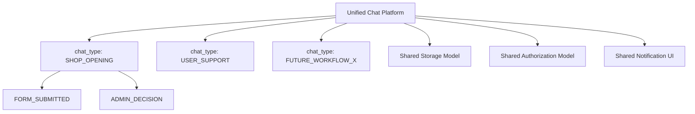
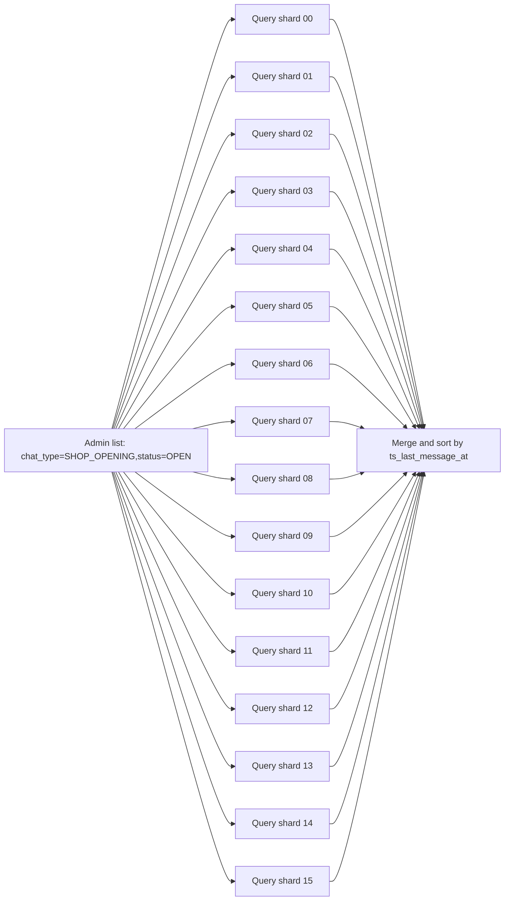
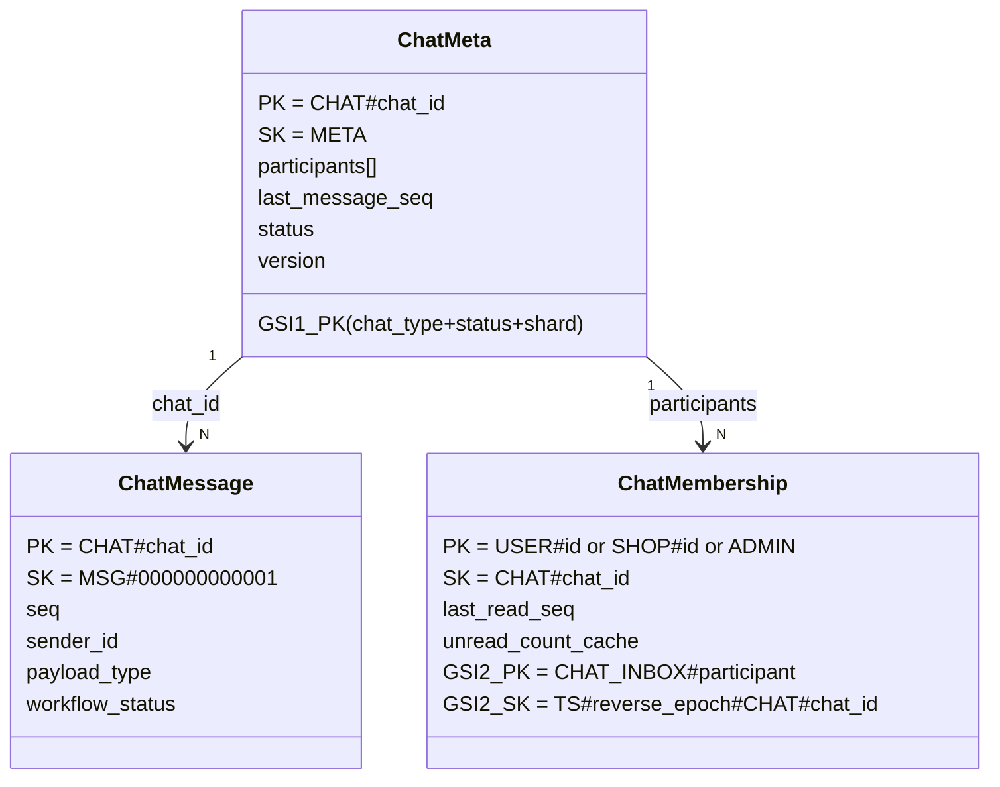
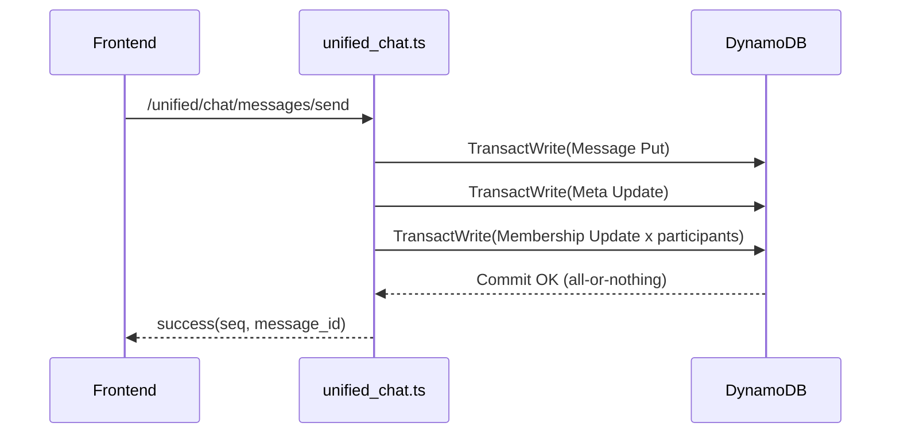

# Unified Chat 実装ガイド (Operation-Oriented)

このドキュメントは、API リファレンスでは説明しきれない
「**どの操作を成立させるために DB をどう設計したか**」を中心に説明します。

---

## 1. この基盤で実現したいこと

Unified Chat は、単なる 1 機能ではなく「複数業務ワークフローを同じ土台で実装する」ための
共通プラットフォームです。

- 現在実装済みの代表: `SHOP_OPENING`（ショップ開設申請）, `USER_SUPPORT` / `SHOP_SUPPORT`（運営との一般問い合わせ）
- 同じ基盤で追加可能: 認証連携系、ショップ支援系、問い合わせ系

### 1.1 プラットフォーム化の構造



ポイント:

- 画面や用途は異なっても、保存構造・認可・通知UIは共通。
- 機能追加は「新しい chat_type と event を registry へ追加」で進める。

---

## 2. DB をどの操作前提で設計したか

### 2.1 前提にした主要操作

DB は以下の操作を高速化する前提で設計しています。

1. 参加者ごとの受信箱を最新順で表示する
2. チャット詳細を開いたとき、本文履歴をページング取得する
3. メッセージ送信時に、一覧表示用の最終情報を即反映する
4. 既読更新時に未読件数を一貫して減算できる
5. 管理者が chat_type + status で案件一覧を絞り込める

### 2.2 操作とレコードの対応表

| 操作 | 主に読むレコード | 主に書くレコード |
| --- | --- | --- |
| 受信箱一覧 | Membership (`GSI2: CHAT_INBOX#...`) | なし |
| チャット詳細表示 | Meta (`CHAT#id`,`META`) | なし |
| 本文履歴取得 | Message (`CHAT#id`,`MSG#...`) | なし |
| メッセージ送信 | Meta + Membership + Message | Message + Meta + 全Membership |
| 既読更新 | Meta + 対象Membership | 対象Membership |
| ステータス更新 | Meta + 全Membership | Meta + 全Membership |

### 2.3 なぜ 3 種レコードに分離したか

- Meta だけに集約すると、履歴増加で 400KB 制限に近づく
- Message を独立化することで履歴ページングが可能
- Membership を独立化することで「参加者受信箱一覧」を 1 クエリで取得可能

### 2.4 shard を入れている理由と使い方

管理者一覧は `chat_type + status` で集中しやすいため、Meta の `GSI1_PK` に shard を含めています。

- キー形式: `CHAT_TYPE#{chat_type}#{status}#{shard}`
- shard 値: `00`〜`15`（`chat_id` ハッシュの `mod 16`）
- 実装: `infra/lambda/unified_chat.ts` の `calcShard(chatId)`

期待効果:

1. 書き込み分散（特定 status への集中を緩和）
2. 管理者一覧の読取分散（16 shard への fan-out 取得）



運用上の注意:

- shard 数は固定設計です。途中変更すると一覧クエリの探索範囲が変わるため、移行なし変更は不可です。
- 管理画面の一覧 API 実装時は、必ず shard fan-out を行う前提で設計します。

### 2.5 shard 分割の恩恵（件数目安）

現行実装は `00`〜`15` の **16 shard** です。
この分割は主に `GSI1_PK=CHAT_TYPE#{chat_type}#{status}#{shard}` の集中を緩和するため、
同一 `chat_type + status` に対する集中耐性を概ね shard 数ぶん押し上げます。

| 観点 | shard なし | 16 shard（00〜15） | 恩恵 |
| --- | ---: | ---: | ---: |
| 同一 chat_type+status への書き込み集中耐性 | 1キー分 | 16キー分 | 約16倍 |
| 管理者一覧の読み取り集中耐性 | 1キー分 | 16キー fan-out | 約16倍 |
| 1キーあたりの負荷 | 100% | 約1/16（均等時） | 約94%低減 |

同時に更新・閲覧される案件数（同一 `chat_type + status`）の目安:

| 同時案件数 | shard なし | 16 shard |
| --- | --- | --- |
| 500件 | 余裕 | 余裕大 |
| 1,000件 | しきい値に近づく | 余裕 |
| 2,000件 | 詰まりやすい | 実用域 |
| 4,000件 | かなり厳しい | 実用域 |
| 8,000件 | 現実的でない | しきい値に近づく |

補足:

- この表は **GSI1 の集中緩和効果**に限定した目安です。
- システム全体の上限は、`Membership` 更新集中（特に `ADMIN` 側）など別ボトルネックでも制約されます。

---

## 3. レコード関係図（件数が増えても追える見取り図）



運用上の読み方:

- 1 チャットにつき Meta は 1 件
- 1 チャットにつき Message は送信数ぶん増える
- 1 チャットにつき Membership は参加者数ぶん作られる

---

## 4. 書き込み整合性（どこを同時更新するか）

### 4.1 メッセージ送信時

`sendMessage()` は `TransactWriteCommand` で以下を原子的に更新します。

1. Message を 1 件追加
2. Meta の最終メッセージ情報を更新
3. 全参加者 Membership の一覧表示情報を更新



### 4.2 ステータス更新時

`updateStatus()` では `version` を条件にした楽観ロックを実施します。

- 条件: `expected_version == current version`
- 不一致時: 競合として失敗（上書き事故を防止）

---

## 5. 画面操作から見たデータフロー

### 5.1 ユーザーが申請する（SHOP_OPENING）

1. `/user` の「申請・チャット」を開く
2. 「ショップ開設申請」ボタンからフォーム入力
3. `/unified/chat/create`（初期 `FORM_SUBMITTED`）
4. Meta + Membership(USER/ADMIN) + Message が作成される

### 5.2 ユーザーが運営へ一般問い合わせする（USER_SUPPORT）

1. `/user` の「申請・チャット」を開く
2. 「運営とチャット」ボタンから初期メッセージ入力
3. `/unified/chat/create`（`chat_type=USER_SUPPORT`）
4. Meta + Membership(USER/ADMIN) + Message が作成される

### 5.3 ショップが運営へ問い合わせする（SHOP_SUPPORT）

1. ショップ管理画面ヘッダーの「申請・チャット」を開く
2. 「運営とチャット」ボタンから初期メッセージ入力
3. `/unified/chat/create`（`chat_type=SHOP_SUPPORT`）
4. Meta + Membership(SHOP/ADMIN) + Message が作成される

### 5.4 管理者が審査する

1. `/admin` 問い合わせタブで `participant_id=ADMIN` 一覧取得
2. 対象チャット詳細を取得
3. 承認/却下を `messages/send` で送信
4. `status/update` で `APPROVED` または `REJECTED` に更新

### 5.5 ユーザー/ショップが通知を見る

1. 共用通知コンポーネントが `list` を取得
2. チャット選択で `get + messages/get`
3. 未読があれば `read/mark`

---

## 6. 新しい chat_type を追加する手順（実装順序固定版）

この手順は「最小事故」で追加するため、順序を固定します。

### Step 1: workflow registry を先に作る

ファイル: `shared/unified-chat-workflows.ts`

実施内容:

1. payload 型を追加
2. validator (`value is Payload`) を追加
3. `WORKFLOW_REGISTRY` に以下を追加
    - `chatType`
    - `initialStatus`
    - `statuses`
    - `events`（`validate`, `nextStatuses`）

### Step 2: API 契約を更新

ファイル: `shared/api-types.ts`

実施内容:

- `UnifiedChatApiSchema` の入力を新タイプで矛盾しないよう更新

### Step 3: Lambda ロジックを接続

ファイル: `infra/lambda/unified_chat.ts`

実施内容:

1. 受信時に `assertValidWorkflowPayload(...)`
2. 状態変更時に `canTransitionTo(...)`
3. 必要なら message payload への保存項目を追加

### Step 4: 画面の表示解釈を追加

ファイル:

- `frontend/components/chat/UnifiedChatNotifications.tsx`
- 必要に応じて user/shop/admin 画面

実施内容:

- 新しい `payload_type` / `workflow_status` の表示分岐を追加

### Step 5: ドキュメント同期

更新対象:

- `documents/REF_API_ENDPOINTS.md`
- `documents/REF_DB_SCHEMA.md`
- 本ドキュメント

---

## 7. API リファレンスに書き切れない運用上の重要事項

1. 受信箱は Membership を正本にしているため、一覧表示は Meta 直読みしない
2. 未読件数は `last_message_seq - last_read_seq` が本質で、`unread_count_cache` は表示高速化用
3. 送信者自身の unread は送信時に 0 更新する
4. 1 チャットの参加者が増えるほど送信時更新数が増えるため、参加者数の上限管理が必要
5. ルーティング誤判定を避けるため path 分岐は完全一致のみ使用する

---

## 8. 実装チェックリスト

1. 追加した chat_type が `WORKFLOW_REGISTRY` に定義されている
2. payload validator が実装され、実行時検証が入っている
3. `messages/send` が `TransactWrite` で Meta/Membership まで更新している
4. `status/update` が `version` 条件を持っている
5. 受信箱取得が `GSI2(CHAT_INBOX#...)` を使っている
6. 通知 UI で既読更新 (`read/mark`) が呼ばれる
7. ドキュメント 3 点（API/DB/本書）が同期されている

---

## 9. ワークフロータイプ毎のステート遷移リファレンス

### 9.1 ステートの概念定義

Unified Chat では、全てのワークフロータイプが以下のステート群から選択します：

| ステート | 意味 | 再開可否 | 用途 |
| --- | --- | --- | --- |
| `OPEN` | 対応中（初期状態） | N/A | 申請/問い合わせ直後、または対応を再開した状態 |
| `RESOLVED` | 対応完了（一時的終了） | 再開可 | 対応が一度完了したが、必要に応じて再開できる段階 |
| `CLOSED` | 最終クローズ（完全終了） | 不可 | チャットを打ち切って記録化する |
| `CANCELLED` | キャンセル/取消 | 不可 | ユーザー発起の申請取下げ、または管理者による取消 |
| `DRAFT` | 下書き（SHOP_OPENING のみ） | N/A | 申請者がフォーム途中保存 |
| `SUBMITTED` | 申請済み（SHOP_OPENING のみ） | N/A | 申請者が完全送信完了 |
| `IN_REVIEW` | 審査中（SHOP_OPENING のみ） | N/A | 管理者が審査開始 |
| `APPROVED` | 承認（SHOP_OPENING のみ） | 不可 | 管理者が申請を認可、shop 作成 |
| `REJECTED` | 却下（SHOP_OPENING のみ） | 不可 | 管理者が申請を棄却 |

### 9.2 主要なワークフロータイプ別ステート遷移

#### 9.2.1 SHOP_OPENING（ショップ開設申請）

```
DRAFT → SUBMITTED → IN_REVIEW → { APPROVED | REJECTED }
                             ↘ CANCELLED (at any point)
```

- **特殊性**: フォーム途中保存とフロー管理が詳細（専用ステートが多い）
- **初期ステート**: DRAFT
- **終端ステート**: APPROVED, REJECTED, CANCELLED
- **payload_type**: `FORM_DRAFT_SAVED`, `FORM_SUBMITTED`, `ADMIN_DECISION`
- **payload**: フォームスナップショット（shop_name, owner_name, contact_email, notes）

#### 9.2.2 CARD_DESIGN（カードデザイン申請）

```
OPEN → RESOLVED → CLOSED
  ↑        ↓
  └────────┘ (必要に応じて再開)

OPEN → CANCELLED (any time)
RESOLVED → CANCELLED (any time)
```

- **特性**: 一般チャット系（USER_SUPPORT/SHOP_SUPPORT と同じステート群）
- **初期ステート**: OPEN
- **終端ステート**: CLOSED, CANCELLED
- **管理者操作**:
  - `OPEN` 状態でのみ「デザイン完了」ボタンが有効
  - クリックで `DESIGN_COMPLETED` workflow メッセージを送信
  - チャット status を `RESOLVED` へ遷移
  - 必要に応じて再度 `RESOLVED → OPEN` で再開可能
- **payload_type**: `FORM_SUBMITTED`, `DESIGN_COMPLETED`
- **payload**: 申請フォーム（design_ready, reference_urls, notes, contact_email）と完了メモ
- **使用シーン**: ショップオーナーがカードデザイン追加をリクエスト → 管理者がテンプレート調整 → デザイン完了 → チャット終結

#### 9.2.3 USER_SUPPORT / SHOP_SUPPORT / SHOP_DESIGN / MISC（一般問い合わせ系）

```
OPEN → { RESOLVED | CANCELLED }
  ↑          ↓
  └──────────┘ (必要に応じて再開)

RESOLVED → { CLOSED | OPEN }
```

- **特性**: 構造化フォーム不要、フロー管理シンプル
- **初期ステート**: OPEN
- **終端ステート**: CLOSED, CANCELLED
- **管理者操作**:
  - `OPEN` 状態: `RESOLVED` または `CANCELLED` へ遷移可
  - `RESOLVED` 状態: `CLOSED` または `OPEN` へ遷移可
- **payload_type**: なし（TEXT/FILE メッセージのみ）
- **フロー例**:
  - 通常終了: `OPEN → RESOLVED → CLOSED`
  - 再対応: `OPEN → RESOLVED → OPEN → RESOLVED → CLOSED`
  - キャンセル: `OPEN → CANCELLED` (any point)

### 9.3 RESOLVED と CLOSED の使い分け（一般チャット系）

**重要**: SHOP_OPENING では使い分けはありません（APPROVED/REJECTED/CANCELLED で終わる）

一般チャット系（USER_SUPPORT, SHOP_SUPPORT, CARD_DESIGN 等）での使い分け：

| 遷移 | 意味 | 再開可否 | 用途例 |
| --- | --- | --- | --- |
| `OPEN → RESOLVED` | 対応は完了したが、必要に応じて再開の余地がある | 再開可 | 問い合わせ結果報告後、確認待ち |
| `RESOLVED → CLOSED` | 完全終了。以降対応なし | 不可 | 問い合わせ解決確認後、記録化 |
| `OPEN → CANCELLED` | キャンセル（対応不要） | 不可 | スパム、既出問題、ユーザー取下げ |

- **RESOLVED**: 対応者が「一度は対応完了と判断」した状態 → ユーザー確認待ち、または追加対応の可能性がある場合
- **CLOSED**: 「完全に記終わり」と確定した状態 → 以降の対応履歴には表示されるが、新規メッセージは受け付けない

### 9.4 CARD_DESIGN のライフサイクル（具体例）

1. **ショップオーナーが申請**
   - ユーザー側で「カードデザイン申請」フォーム入力
   - 要素: デザイン確定済みか、参考URL、その他要望、連絡先メール
   - チャット作成: `chat_type: CARD_DESIGN`, `status: OPEN`
   - 初期メッセージ: `FORM_SUBMITTED` workflow メッセージ（form_snapshot 保持）

2. **管理者がレビュー（チャット内でやり取り）**
   - 管理画面で OPEN チャット表示
   - detail view に form_snapshot が表示される
   - テキスト/ファイルで質問・提案をやりとり
   - 例: 参考にしたURLの詳細確認、デザイン修正提案など

3. **管理者がデザイン完了処理**
   - 管理画面: 「デザイン完了にする」ボタン（OPEN 状態のみ有効）
   - クリック後、オプショナルなメモを入力可
   - `DESIGN_COMPLETED` workflow メッセージ送信
   - `status: OPEN → RESOLVED` へ自動遷移

4. **チャット終結処理**
   - 管理画面: `RESOLVED → CLOSED` で完全終了
   - または必要に応じて `RESOLVED → OPEN` で再開して追加対応
   - 最終的に CLOSED 状態でアーカイブ

5. **記録化**
   - CLOSED 状態で終端 → 過去チャット表示に移動
   - 以降のメッセージ送受信不可
