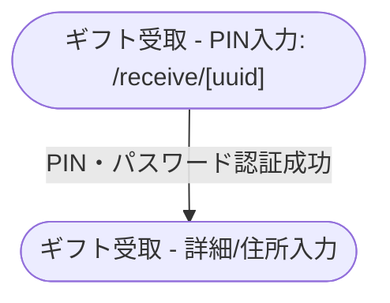

# 画面一覧とページ遷移・操作ガイド

本ドキュメントでは、「名刺代わりに」アプリケーションに存在する画面遷移、また各画面で実行可能な操作について解説します。

---

## ページ遷移の全体図

アプリケーションは大きく「**一般・認証関連ページ**」「**ショップ管理者向けページ**」「**システム管理者向けページ**」「**受取人・エンドユーザー向けページ**」の4つに分かれます。


### ショップ管理者・システム管理者
```mermaid
graph TD
    %% 共通・認証
    Home(["トップページ: /"])
    Login(["ログイン: /login"])
    Register(["新規登録: /register"])
    Verify(["アカウント認証: /verify"])
    MFASetup(["MFA設定: /mfa-setup"])

    %% ショップ管理
    ShopList(["ショップ一覧: /shop"])
    ShopDetail(["個別ショップ管理: /shop/[shopId]"])

    %% 管理者
    Admin(["システム管理画面: /admin"])

    %% 遷移
    Home -->|ショップ管理者向け| Login
    Login -->|新規登録| Register
    Register -->|検証コード入力| Verify
    Verify -->|登録完了| Login
    Login -->|ログイン成功 (MFA完了)| ShopList
    Login -->|管理者 & MFA未設定| MFASetup
    MFASetup -->|MFA設定完了後| Login

    ShopList -->|ショップ作成/選択| ShopDetail
    Login -->|ログイン中 & 管理者権限あり| Admin
```

### 受取人


---

## 1. 一般・認証関連ページ

### a. トップページ (`/[locale]/`) [https://meishigawarini.com](https://meishigawarini.com)
* **概要**: ユーザーに対するサービスの簡単な説明を行うランディングページです。
* **可能な操作**:
  * **ログインページへの遷移**: 画面上に配置されたリンク・ボタン（例: 「ログイン」や「ショップの方はこちら」等）をクリックし、Cognito認証により管理画面へアクセスするための `/login` ページへ遷移します。
  * **言語切り替え (Locale Switch)**: 画面上の言語選択UI（プルダウンメニュー等）を操作し、表示言語（ja, en等）をダイナミックに切り替えます。

### b. ログイン (`/[locale]/login`) [https://meishigawarini.com/login](https://meishigawarini.com/login)
* **概要**: Cognitoを利用した既存ユーザーのサインイン用ページ。
* **可能な操作**:
  * **サインイン処理実行**: フォームに登録済みのメールアドレスとパスワードを入力し「ログイン」ボタンを押下します。裏側でAWS Cognito API (`signIn`) を呼び出し、認証に成功するとセッションを確立してショップ一覧 (`/shop`) へ自動リダイレクトされます。
  * **MFA（二段階認証）**: ログイン成功後、TOTPコード（認証アプリの6桁コード）の入力が求められます。正しいコードを入力することで認証が完了し、ショップ一覧へ遷移します。
  * **MFA未設定の管理者向け誘導**: `Administrators` または `GlobalAdmins` グループのユーザーがMFAを完了していない状態でログインした場合、自動リダイレクトは行われず、MFA設定ページ (`/mfa-setup`) へのリンクが画面上に表示されます。
  * **既ログイン中の場合のナビゲーション**: すでにログイン状態でこのページを開いた場合、画面右上に「ショップ管理者画面」「QR生成・管理者画面（管理者のみ）」「ログアウト」ボタンが表示されます。
  * **未確認ユーザーの自動遷移**: サインイン試行時、アカウントは存在するがメール認証が未完了（`UserNotConfirmedException` 等）であると判定された場合、自動的に検証コード入力画面 (`/verify?username=...`) へ遷移し、アカウント有効化フローを再開させます。
  * **新規登録ページへの遷移**: アカウントを持たない新規ユーザー向けに、画面下部の「新規登録」関連リンクからアカウント作成ページ (`/register`) へ遷移します。

### c. 新規登録 (`/[locale]/register`) [https://meishigawarini.com/register](https://meishigawarini.com/register)
* **概要**: 新規のショップオーナーなどがアカウントを作成するページ。
* **可能な操作**:
  * **新規アカウント作成（サインアップ処理）**: メールアドレスとパスワードを入力して「登録」ボタンを押下します。Cognito API (`signUp`) が呼び出され、成功すると入力したメールアドレス宛に6桁の検証コードが送信されます。その後、自動的に `/verify?username=...` に遷移してコード入力待ち画面へと誘導されます。
  * **ログインページへの遷移**: 既にアカウントを持っているユーザーが誤って訪れた場合のために、「ログインはこちら」リンクから `/login` へ遷移し、通常のサインインフローに戻ることができます。

### d. アカウント認証 (`/[locale]/verify`) [https://meishigawarini.com/verify](https://meishigawarini.com/verify)
* **概要**: サインアップ後、メールに届いた確認コード（検証コード）を入力してアカウントを有効化するページ。
* **可能な操作**:
  * **検証コードの入力とアカウント本登録（認証処理）**: URLパラメータまたは手入力で引き継がれたメールアドレスに対し、メールで届いた6桁の確認コード（検証コード）を入力して送信します。Cognito API (`confirmSignUp`) が呼び出され、検証に成功するとアカウントが正式に有効化されます。
  * **ログイン画面への遷移**: 認証成功後、画面の案内に従ってボタン操作または自動遷移により `/login` へ遷移し、初回ログインを実行します。

### e. MFA設定 (`/[locale]/mfa-setup`) [https://meishigawarini.com/mfa-setup](https://meishigawarini.com/mfa-setup)
* **概要**: ログイン済みユーザーが二段階認証（TOTP）を設定するページ。管理者グループのユーザーはMFAが必須であり、未設定の場合はこのページへ誘導されます。
* **可能な操作**:
  * **認証アプリ (TOTP) の設定**: 画面上に表示されるQRコードを、Google Authenticator などの認証アプリでスキャンします。その後、アプリに表示された6桁のコードを入力して「認証して登録」ボタンを押すことで、TOTP方式のMFAが有効化されます。
  * **設定完了後のログアウト**: MFA設定が完了すると成功画面が表示され、「ログイン画面へ戻る」ボタンを押すと自動的にログアウトしてログインページへ遷移します。MFAを有効にした状態で再ログインすることで、管理APIへのアクセスが可能になります。


## 2. ショップ管理者向けページ

認証された既存のショップ管理者が自身の店舗や商品を管理するセクションです。
   

### a. ショップ一覧 (`/[locale]/shop`) [https://meishigawarini.com/shop](https://meishigawarini.com/shop)
* **概要**: ログイン済みユーザーが管理している（権限をもつ）ショップの一覧を表示するダッシュボードの入り口。**ショップが一つだけの場合は直接そのショップの管理者画面にリダイレクトします．**
* **可能な操作**:
  * **所有するショップの一覧表示と選択**: ログインユーザーが権限を持つ（DynamoDBから取得される）ショップの一覧がカードやリスト形式で表示されます。特定のショップのUI要素をクリックすると、そのショップ専用の管理ダッシュボード (`/shop/[shopId]`) へ遷移します。
  * **【無効化】新規ショップの作成**: 「新規ショップ作成」ボタンを押下するとダイアログ・モーダルが開き、ショップ名を入力して作成処理を実行できます。バックエンドAPIがコールされてDBに新規店舗レコードが作成され、完了後に一覧表示が自動更新されて画面に反映されます。
  * **ログアウト処理**: 画面上のアバターやメニュー内にある「ログアウト」ボタンを押下することで、Cognitoのローカルセッションを破棄（`signOut`）し、トップページまたはログインページへ安全に離脱・リダイレクトします。

### b. 個別ショップ管理 (`/[locale]/shop/[shopId]`) [https://meishigawarini.com/shop/UUID(dummy)](https://meishigawarini.com/shop/UUID)
* **概要**: 特定のショップにおける商品管理、QRコードの紐付け、および受注の発送処理を行うメインダッシュボード。
* **可能な操作一覧**:
  * **商品の新規作成 (Create Product)**: 「新規商品作成」機能を利用して、商品名、説明テキスト、価格、受取有効日数などの必要情報を入力します。商品画像を選択した場合、システム内で自動的に規定比率（16:9等）へリサイズされ、S3バケットへアップロードされます。保存を実行するとデータベースに商品情報が登録（`product_id` 発行）され、一覧に即座に追加されます。
  * **商品一覧の閲覧とステータス管理**: 
    * 登録済みの全商品リストをテーブル等で確認でき、各項目の詳細を把握します。
    * **ステータストグル機能 (`ACTIVE` ↔ `STOPPED`)**: 個々の商品の有効/無効を切り替えます。ステータスを `STOPPED` に設定した商品は、後述する「QRコードとの紐付け」時のプルダウンリスト（選択肢）から自動的に除外され、これ以上の新規QRの割り当てができなくなります。
    * **商品の削除**: 商品のステータスが `STOPPED` であり、かつ、その世の中に「有効化済みだが未発送・未受取」のQRコードが一つも紐づいていない（安全に削除できる状態の）場合のみ、明示的な削除操作（ゴミ箱アイコン等のクリック）によってDBから完全削除を実行できます。
  * **QRコードと商品の紐付け処理 (Link QR & Activate QR)**:
    * **QRコードのスキャンまたは手入力**: デバイスのカメラを起動して物理的なQRコードを読み取るか、UI上の入力フォームからQRのUUIDを手入力して対象のQRコードを特定します。
    * **商品紐付けとアクティベート**: QRの特定が成功した後、紐付ける対象の「商品（Product）」をドロップダウンメニュー（現在 `ACTIVE` な商品のみ表示）から選択します。すでにリンク済みの商品(生成時からリンク付けしている場合)はこの操作は不要です。
    * **一言メモの付与と確定**: 任意で、受取人向けのメッセージ（`memo_for_users`：ギフト受取ページでユーザー側に実際に表示される文章）や、自店舗での運用管理用メモ（`memo_for_shop`）を入力します。完了処理を実行すると、QRコードのステータスが `UNASSIGNED` 等から `ACTIVE`（受取待ち）へと変更され、システムに登録されてエンドユーザーがアクセス可能な状態になります。
  * **受注 (Orders) の管理と発送手続き**:
    * **受注一覧の表示とソート**: 商品が紐づいた後のステータス (`LINKED`, `ACTIVE`, `USED`, `SHIPPED`, `COMPLETED`, `EXPIRED`, `BANNED`) を持つQR・受注情報の一覧が表示されます。ユーザーが住所入力を完了した `USED` 状態のものなど、対応が必要な順（日時の新しい順）にソートして表示されます。
    * **絞り込み検索とリフレッシュ**: UUIDの部分一致で受注を現在の表示をフィルタリングできます(リフレッシュボタンのようにDBとの同期は行いません)。また、手動リフレッシュボタンにより最新のDB状態を取得して，強制的に同期できます。
    * **受注詳細情報の確認**: テーブルの行をクリックするとダイアログが開き、紐づく商品名、受取人名、指定された配送先住所・郵便番号、電話番号、希望日時、ステータス変更履歴などの詳細な注文情報（住所録）を包括的に確認できます。
    * **発送処理の実行 (Ship Order)**: 受注ステータスが `USED`（発送待ち状態）の場合、詳細ダイアログ内または一覧の「発送する」機能から発送ステータスへの更新処理を実行できます。利用する配送業者名（ヤマト運輸、佐川急便など）の選択と追跡番号（トラッキングナンバー）を入力し、必要に応じてショップ/ユーザー向けの発送メモを追記して「発送完了」を実行します。これによりQRのステータスが `SHIPPED` に更新され、エンドユーザー側からもQRコード経由で配送状況の確認が可能になります。
  * **注文メタ情報の編集 (Update Order Meta)**: すべての受注に対して（ステータス不問）、詳細ダイアログ内から配送業者・追跡番号・ショップメモを更新できます。ユーザー向けメッセージ (`memo_for_users`) は `COMPLETED`・`EXPIRED`・`BANNED` 状態の受注は編集不可です。配送に関する情報も発送待ち以外の状態では編集できません。
  * **ログアウト処理**: 画面ヘッダー部の「ログアウト」ボタンを押下することで、Cognitoのセッションを破棄 (`signOut`) し、ログインページへリダイレクトされます。

---

## 3. システム管理者向けページ

### a. システム管理ダッシュボード (`/[locale]/admin`) [https://meishigawarini.com/admin](https://meishigawarini.com/admin)
* **概要**: 全体システムのQRコード一括生成、状態の個別監視、バン(Ban)処理を行う、オーナー（Administratorsグループ）のみがアクセス可能なページ。リンク直打ちでしかアクセスできない。
  
* **可能な操作一覧**:
  * **QRコードの一括生成 (Batch Generate)**:
    * **バッチ作成**: 「QRコード生成」機能から、生成したい枚数（現在MAX 10枚）を指定してバッチ処理を実行します。システムが裏側でセキュアなUUIDとランダムなPINコード（4桁等）のペアを新規に生成し、DBへ一括登録します。
    * **事前割り当て生成**: 特定のショップの特定の商品限定で使うために、予め `shopId` と `productId` を紐付けた状態（LINKED状態）でQRコード群を発行・生成することが可能です。ショップと商品の両方を指定した場合のみLINKED状態のコードを生成可能です。どちらも指定しない場合はどのショップ・商品にも紐づけできるQRコード(UNASSIGNED状態)が生成されます。(片方のみの指定はエラー)
  * **印刷用PDFの生成とダウンロード**:
    * **PDF自動生成とダウンロード**: QRコードのバッチ生成処理完了直後、システムはそのバッチに含まれる全てのQR画像と対応するPINコードをレイアウトした「両面印刷用（またはラベル印刷用）PDFファイル」を自動生成・ダウンロードします。
    * **過去バッチの再ダウンロード**: 生成履歴（バッチリスト）から、過去に生成した特定のバッチのPDFを何度でも再ダウンロードできます。ページ再読み込みで消えます(要修正？)。
  * **QRコードのステータス別監視機能**:
    * **ステータス別一覧表示**: システム全体の全QRコードを、現在のステータス (`UNASSIGNED`, `LINKED`, `ACTIVE`, `USED`, `SHIPPED`, `COMPLETED`, `EXPIRED`, `BANNED`) ごとのタブ表示やフィルタを用いて呼び出し、それぞれの総数や一覧リストを横断的に監視・確認できます。
    * **個別検索機能 (`SEARCH`)**: エンドユーザーやショップからの問い合わせ対応時等に、UUIDの前方一致や完全一致などのキーワードを入力して検索を実行し、特定のQRコードが現在どのような状態にあり、どのショップ/商品に紐づいているかを照会・特定します。
  * **詳細確認と不正処理 (Ban)**:
    * **バン (`BANNED`) 処理**: 不正利用、盗難、または情報漏洩が疑われるQRコードを発見した場合、各QRコードの詳細表示における「Ban（無効化）」機能を利用してそのQRのステータスを強制的に `BANNED` へ変更します。BANNED状態になったQRコードは機能が完全に停止され、受取側でのアクセスやショップ側での一切の操作がシステムレベルでブロックされます。
    * **単発QRの再ダウンロード**: 運用上のトラブルで個別再発行がどうしても必要なケースにおいて、特定の一つのUUIDに対するPDF単体を再ダウンロード・印刷するリカバリー機能を利用できます。
    * **クリーンアップ実行**: `BANNED` 状態のコードは一括でデータベースから完全に削除することが可能です。この場合、関連する一切の履歴が完全に消去されるため注意が必要です。

---

## 4. 受取人・エンドユーザー向けページ

### a. ギフト受取ページ (`/[locale]/receive/[uuid]`)
* **概要**: QRコードを読み取ったエンドユーザーが、PINを入力し、ギフトの受取先情報を入力して商品を要求・受領する動的ページ。

* **可能な操作・各ステップ状態の一覧**:
  * **PIN入力ステップ (初期アクセス時 / `ACTIVE`等)**:
    * スマホ等のカメラでQRコードを読み取ってページにアクセスすると、まずPINコードの入力画面が表示されます。ユーザーは手元の物理カードに記載されたPINコードを入力・送信します。サーバー側でUUIDと紐づくPINの整合性がチェックされ、正しい場合のみ後続のステップ（ギフト内容の表示など）へ進行できます。
  * **パスワード認証解除ステップ (`RESTRICTED`状態)**:
    * ショップ管理者が商品の紐付けの際に、追加のパスワード保護（合言葉など）を設定しているケースにおいて、PIN通過後にパスワード入力画面が表示されます。ショップから別途提供されたパスワードを正しく入力して送信することで、制限が解除され商品情報が閲覧可能になります。
  * **ギフト情報の閲覧と配送先入力 (`ACTIVE/FORM`状態)**:
    * PINおよびパスワード認証を通過すると、紐づけられた商品の画像、説明テキスト、残りの受取有効日数（期限）、およびショップから贈られた個別メッセージ（`memo_for_users`）が画面上に表示されます。
    * **受取情報の入力と送信**: 画面下部の入力フォームを使用し、自身の氏名、郵便番号（APIの自動住所入力支援適用等は今後の課題？）、住所詳細、電話番号、連絡・通知用メールアドレス、および配達希望日時（オプション）を選択・入力します。利用規約やプライバシーポリシーに同意の上「確定して受け取る」ボタンを押下すると、情報がバックエンドへ安全に送信・保存され、QRステータスが `USED` （住所入力完了/発送待ち）に移行します。
  * **配送待機ステップ (`SUCCESS/USED`状態)**:
    * 配送先住所の送信処理が成功すると、サンクスメッセージと共に「ショップの発送手配をお待ちください」といった待機案内画面が表示されます。この状態に移行すると、ユーザー側からは情報の再変更は行えず、ショップ側の実地での発送対応（ステータスの進行）を待つことになります。
  * **発送済み・追跡・受取報告ステップ (`SHIPPED`状態)**:
    * ショップ側が発送処理を完了してシステム上のステータスが `SHIPPED` になると、ユーザーが再度このページ（同じURL）にアクセスした際、画面の表示が切り替わり、利用された配送業者名と荷物の追跡番号（トラッキングナンバー）が明示されます。提供されたリンクから直接配送業者の追跡システムへ遷移して状況を確認することが可能です。
    * **受取完了報告**: 実際に手元へ荷物が無事到着した後、画面上の「商品を受け取りました」ボタンを押下することで、取引が無事完了したことをシステム全体とショップに通知し、システムのステータスが最終化状態である `COMPLETED` に変更されます。
  * **取引完了・有効期限切れステップ (`COMPLETED`・`EXPIRED`状態)**:
    * ユーザーによる受取完了操作後（`COMPLETED`）、あるいはシステムが定める有効期限を過ぎた後（`EXPIRED`）にページへアクセスした場合、個人情報入力フォームや追跡情報は保護の観点から非表示となります。代わりに「お受け取りありがとうございました（取引完了）」や「このギフトは有効期限が切れました」といった案内メッセージのみが表示され、ページ上でのそれ以上の操作は一切ブロックされます。
  * **ショップへの連絡・チャット機能（PIN通過後共通）**:
    * 手続き中の不明点などについては、画面上に配置された「ショップへのお問い合わせ」ボタンから、システムから割り振られた現在のオーダーID（問い合わせ番号）、対応するショップ名、ショップの代表メールアドレスなどの基幹情報をいつでも照会できます。
    * **チャット連絡**: 専用のチャットUIを通じて、QRコードおよびPINコードのわかる人(主に送り主・受け取り主を想定)と直接メッセージの送受信が可能です。主に送り主が電子的なコメントを事前に残しておくことを想定しています。この同ウィンドウ内には、手動のメッセージだけでなく受け取り完了といったシステムの自動イベント履歴もログとして時系列で混在表示されます。
    * **メール通知の購読設定**: チャット機能にショップからの新しい返信メッセージが届いた際にユーザーが見逃さないよう、自身のメールアドレスを「通知先」として登録（サブスクライブ）し、更新通知アラートをメールで受け取れるようになります。
