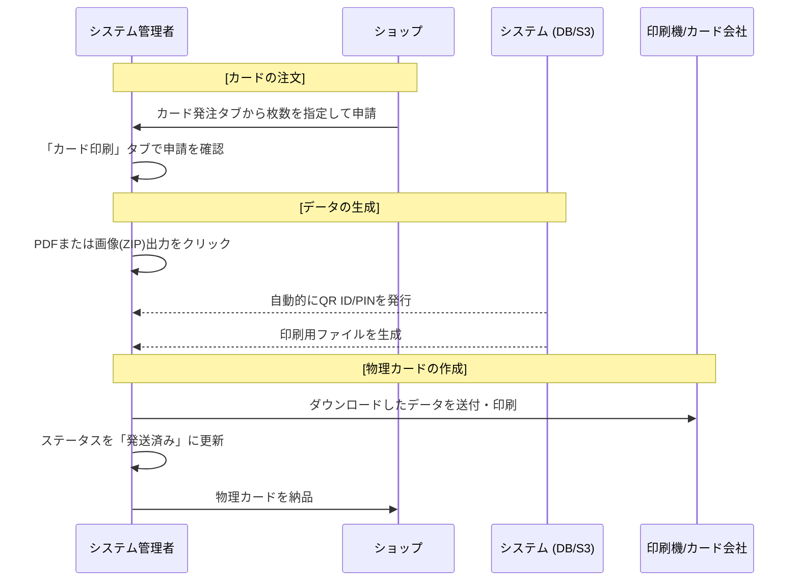

# 運用フロー

システム管理者が行う主な業務の流れを解説します。

## 1. カードの発行・供給フロー

ショップからの要望に応じて、またはプロモーション用にカードを発行する際の流れです。

## 2. ショップ・デザインのセットアップ

新しく提携ショップが増えた際や、デザインを更新する際の流れです。

- **ショップ開設**: [ショップ管理](/admin)タブから、オーナーとなるユーザーIDを指定してショップを新規作成します。
- **デザイン紐付け**: 特定のショップでのみ使用を許可するデザインがある場合、[ショップ管理](/admin)内の「デザイン紐付け設定」で制限をかけます。
- **デザイン追加**: [デザイン設定](/admin)タブから、新しいカードの背景画像やQRコードの配置レイアウトを登録します。

## 3. 監視・メンテナンス

問い合わせ対応や、不正利用への対応フローです。

- **ステータス確認**: [カード一覧](/admin)から、特定のQRコードが現在「未使用」「有効化済み」「受取済み」のどの段階にあるかを確認します。
- **BAN処理**: カードの紛失届があった場合や、不正な利用が疑われる場合、「詳細」からステータスを「BANNED」に変更することで、そのカードを無効化します。
- **データメンテナンス**: [ツール](/admin)タブを使用し、DynamoDBの低レイヤーなデータダンプ（PK/SK指定）を行い、詳細な調査や修正を行います。

