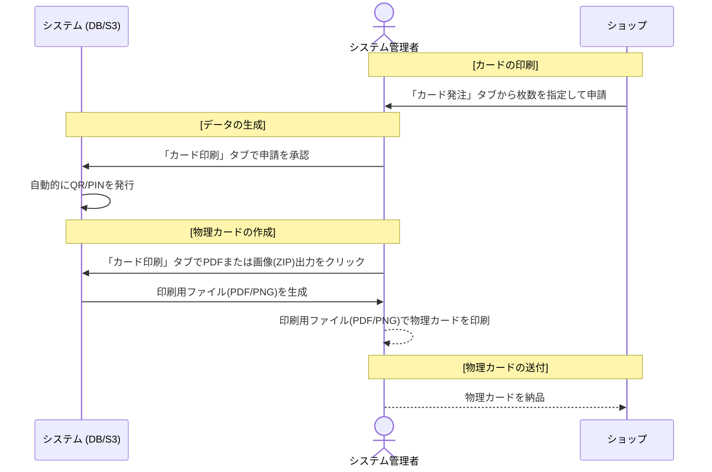
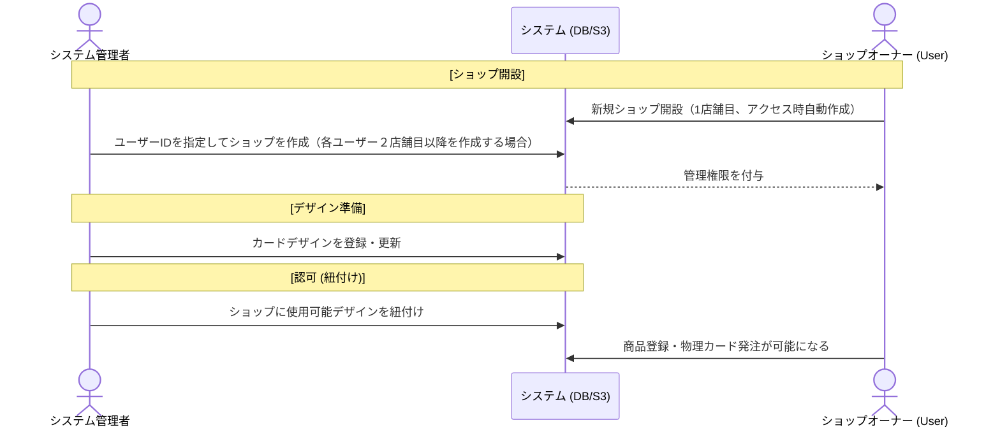
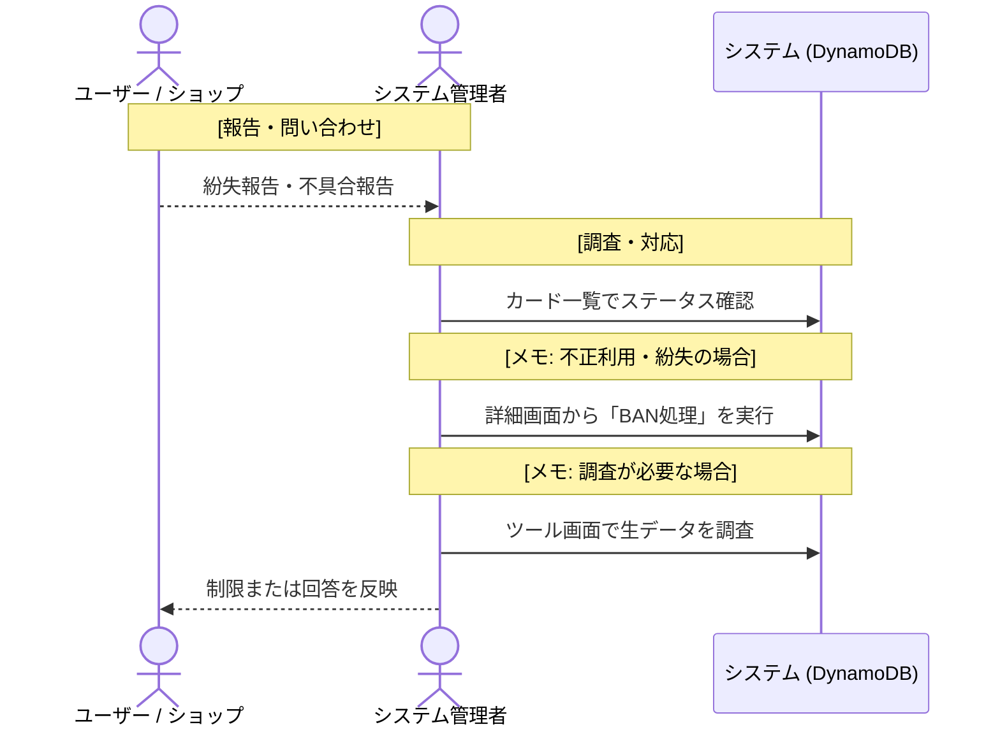

# ご利用の流れ

システム管理者が [管理者ダッシュボード](/admin) を通じて行う主な業務の流れを解説します。ギフト受け渡しを含めた全体的なフローは「[ショップの運用フロー](/help/shop/flow)」を参照してください。

## 1. カードの発行・供給フロー

ショップからの要望に応じて、またはプロモーション用にカードを発行する際の流れです。
点線はシステム以外で行う作業です。

## 2. ショップ・デザインのセットアップ

新しく提携ショップが増えた際や、デザインを更新する際の流れです。

- **ショップ開設**: [ショップ管理](/admin/help/shops) タブから、オーナーとなるユーザーIDを指定してショップを新規作成します。詳しい手順やIDの確認方法もこちらをご確認ください。
- **デザイン紐付け**: アカウント作成直後のショップは、使用を許可されたカードデザインが存在しないため、商品の追加やカードの発注ができません。ショップ管理内の「デザイン紐付け設定」でショップごとに利用可能なデザインを設定することで、実質的にショップの認可を行います。
- **デザイン追加**: [デザイン設定](/admin/help/designs) タブから、新しいカードの背景画像やQRコードの配置レイアウトを登録します。

## 3. 監視・メンテナンス

問い合わせ対応や、不正利用への対応フローです。

- **ステータス確認**: [カード一覧](/admin/help/qrcodes) から、特定のQRコードが現在「未割り当て」「有効化済み」「受取済み」等のどの段階にあるかを確認します。
- **BAN処理**: カードの紛失届があった場合や、不正な利用が疑われる場合、「詳細」からステータスを「BANNED」に変更することで、そのカードを無効化します。
- **データメンテナンス**: [ツール](/admin/help/tools) タブを使用し、データベースの詳細なレコード検索（キー指定による生データ検索）を行い、不具合やデータの詳細な調査・修正を行います。

## 4. 権限について

システム管理画面は **管理者（Administrators / GlobalAdmins）** 権限を持つユーザーのみがアクセス可能です。また、多要素認証（MFA）が必須となっています。

### 1 管理者（Administrators）
システム管理画面にアクセスが可能です。

### 2 GlobalAdmins
システム管理画面にアクセスが可能で、他のユーザーが管理しているすべてのショップを管理できます。
