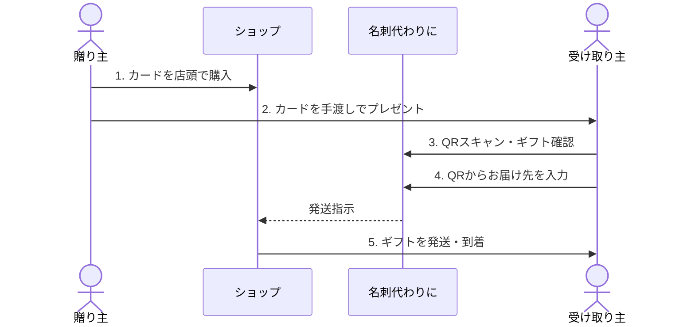

<section class="manual-container">

# ご利用の流れ（全体フロー）

「名刺代わりに」をご利用いただく際の、カードの購入からギフトの到着までの流れをご説明します。

## 全体フロー

<section class="notice">
以下の5つのステップで、簡単にギフトを贈ったり受け取ったりすることができます。
</section>

### サービスの全体像

### 1 カードを購入する
ショップやイベント会場にて、ギフトカードを購入してください。カードには「名刺代わりに」の体験を始めるためのQRコードが印字されています。

### 2 メッセージを添えて贈る
贈り主（あなた）のプロフィールやメッセージを登録し、大切な相手にカードをプレゼントします。カードを渡すことで、デジタルとリアルの両方でつながることができます。

### 3 QRコードをスキャン
受け取った方は、スマートフォンのカメラでカードの裏面にあるQRコードを読み取ります。画面には贈り主からのメッセージやギフトの内容が表示されます。

### 4 お届け先情報を入力
ギフト内容を確認し、お届け先情報を入力します。

### 5 ギフトが届く
ショップにて発送準備が整い次第、入力いただいたご住所へギフトが配送されます。到着を楽しみにお待ちください！

### 6 思い出をいつでも見返す
ギフトを受け取って終わりではありません。カードのQRコードは、あなたと贈り主をつなぐ「**デジタル名刺**」として残り続けます。

- **マイページで管理**: [マイページ](/user)の履歴から、いつでも過去のやり取りやメッセージを見返すことができます。
- **いつでも連絡**: 贈り主がプロフィールを更新していれば、いつでも最新の連絡先やSNSを確認し、つながりを維持することができます。

---

<section class="hero">

# 名刺代わりにが贈る、新しいギフトの形

</section>

<section class="benefit">

### 手渡しの「想い」をのせて
デジタル全盛の時代だからこそ、物理的なカードを「手渡す」という行為には、言葉以上の重みが宿ります。その瞬間の温度感も一緒にプレゼントしましょう。

</section>

<section class="benefit">

### モノとして残る、唯一の価値
受け取ってスキャンした後も、カードはあなたの手元に残ります。ふとした時に目に入るその一枚が、大切な人との思い出を呼び起こすトリガーになります。

</section>

<section class="benefit">

### 連絡先も、思い出も、これ一枚で
カードは単なるギフトの引き換え券ではありません。最新の連絡先がいつでも確認できる「動く名刺」として、受け取った後の関係性をより豊かに彩ります。

</section>

<section class="benefit">

### 終わらない、ギフトのストーリー
ギフトが届いた後も、チャットで感謝を伝えたり、過去の旅路を振り返ったり。「名刺代わりに」は、贈った瞬間から始まる新しい物語を支え続けます。

</section>

## まずはアカウントを作りましょう

<section class="notice">

贈り主も受け取り主も、アカウントをお持ちいただくことで履歴の確認や住所入力の利用がスムーズになり，名刺情報（プロフィール）の設定・更新ができるようになります。

[**ログイン・新規登録はこちら**](/login)
</section>

</section>
