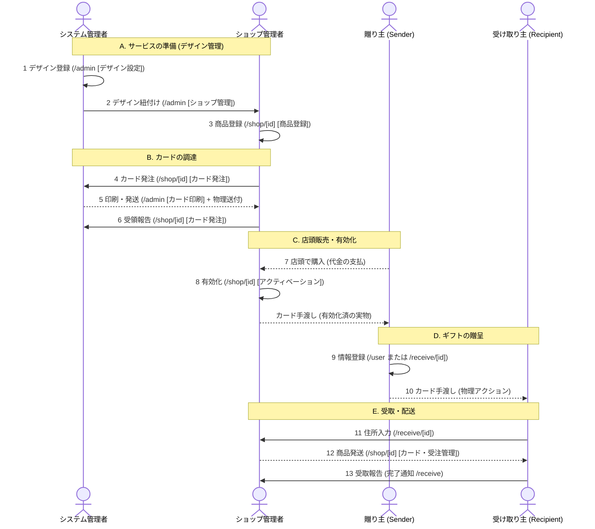

<section class="manual-container">

# 運用フロー

ショップの開設からカードの発注、商品の発送までの主要な業務フローを解説します。

## 1. 全体シーケンス図

ショップ運営に関わる各ロール（システム管理者、ショップ管理者、贈り主、受け取り主）の相互作用をまとめたフロー図です。

## 2. フェーズ別詳細

### Step A: サービスの準備
*   **デザイン管理**: システム管理者が登録したデザインを、あなたのショップで利用できるように紐付けてもらいます。
*   **商品登録**: [ショップ管理画面](/shop)の「商品登録」タブから、ギフトとして提供する商品を登録します。

### Step B: カードの調達
*   **カード発注**: 「カード発注」タブから必要な枚数を申請します。
*   **受領報告**: 物理カードが届いたら、発注履歴から「受け取り完了」を報告することで、運用が開始できます。

### Step C: 店頭販売と有効化
*   **アクティベーション**: 顧客がカードを購入した際、必ず「アクティベーション」タブでQRコードをスキャンして有効化してください。有効化されていないカードはギフトとして利用できません。

### Step E: 受注と配送
*   **発送管理**: 受取人が住所を入力すると通知が届きます。「カード・受注管理」タブで配送先を確認し、商品を発送してください。発送後は追跡番号などを登録してステータスを更新します。

</section>
