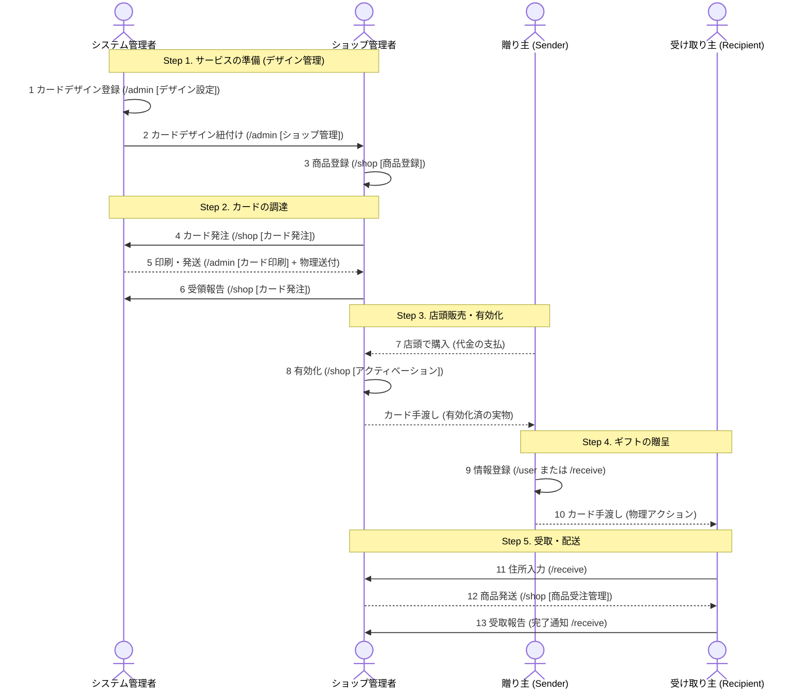

<section class="manual-container">

# ご利用の流れ

ショップ管理における初期設定からカードの発注、商品の発送までの主要な業務の流れを解説します。

※ショップをまだ開設していない方は、まず初めに「[アカウント登録](/help/shop/atfirst)」を行ってください。

## 1. 全体の流れ

ショップ運営に関わる各立場（システム管理者(運営)、ショップ管理者、贈り主、受け取り主）の相互作用をまとめた流れ図になります。特に左から2人目の **ショップ管理者** の縦列をご確認ください。

## 2. 事前準備 

### Step 1: サービスの準備
- **デザイン管理**: あなたのショップで利用できるカードデザインをシステム管理者に紐付けてもらいます。　*→詳細*「[オリジナルカードデザイン作成](/help/shop/card-design)」
- **商品登録**: ショップ管理画面の「商品登録」タブから、あなたのショップで扱う商品を登録します。　*→詳細*「[ショップの設定・商品登録](/help/shop/manage)」

### Step 2: カードの調達
- **カード発注**: 「カード発注」タブから必要な枚数を申請します。
- **受領報告**: 物理カードが届いたら、発注履歴から「受け取り完了」を報告することで、運用が開始できます。　*→詳細*「[カード印刷発注](/help/shop/card-order)」

## 3. 販売・発送

### Step 3: 店頭販売と有効化
- **アクティベーション**: 顧客がカードを購入した際、必ず「アクティベーション」タブでQRコードをスキャンして有効化してください。有効化されていないカードはギフトとして利用できません（不正利用を防止するためになります）。　*→詳細*「[アクティベーション](/help/shop/activate)」

※ 事前にアクティベーションすることも可能です。
※ アクティベーションするとその商品の設定に応じた有効期限が設定されますので、期限が切れないようご注意ください。正確な有効期限は、各カードのQRコードから確認できます。

### Step 4: ギフトの贈呈
- **カードの贈呈**: 店頭でカードを買った送り主が、任意の受け取り主にカードをプレゼントします。（ショップ側で行うことはありません）

### Step 5: 受注と配送
- **発送管理**: 受け取り主が住所を入力すると通知が届きます。「商品受注管理」タブで配送先を確認し、商品を発送してください。発送後は追跡番号などを登録してステータスを更新します。　*→詳細*「[商品受注管理](/help/shop/shipping)」

</section>
